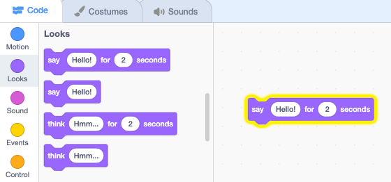
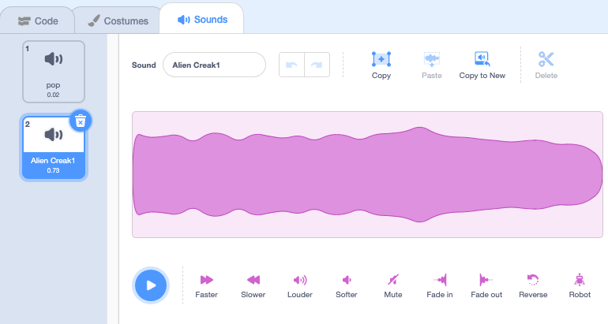

## Pico plays a sound

Sprites can emote in different ways. Let's get Pico to play a sound by coding with Scratch blocks.

To use blocks you can click on them in the Blocks menu.

--- task ---

Open the `Looks`{:class="block3looks"} blocks menu. Click on a `say [Hello!] for [2] secs`{:class="block3looks"} block.


Pico will show a speech bubble for two seconds.


--- /task ---

Blocks can be dragged to the Code area and used from there.

--- task ---

Drag the `say [Hello!] for [2] secs`{:class="block3looks"} block to the Code area. Click on it again.




--- /task ---

You can connect blocks together in the Code area to use more than one at a time.

--- task ---

Drag a `when this sprite clicked`{:class="block3events"} block from the `Events`{:class="block3events"} block menu and connect it to the top of your `say [Hello!] for [2] secs`{:class="block3looks"} block in the Code area. The blocks will snap together.


```blocks3
+when this sprite clicked
say [Hello!] for [2] secs // hide after 2 seconds
```

--- /task ---

--- task ---

Test: Test your code by clicking on Pico on the Stage.

--- /task ---

Another way to communicate is to use sound.

--- task ---

Click on the **Sounds** tab for the **Pico** sprite and you’ll find a `pop` sound. Click on the **play** button to hear the pop sound.


--- /task ---

You can use this sound in your project but there are some fantastic alien sounds in Scratch too.

--- task ---

To choose a new sound click on the **Choose a Sound** button and select the **Space** category.


--- /task ---

--- task ---

Play a few different sounds using the play buttons. Once you have found the one you want to use click on it to add it to your project.



--- /task ---

--- task ---

Click back on the **Code** tab. From the `Sound`{:class="block3sound"} blocks menu find the `start sound`{:class="block3sound"} block. Drag the block into the Code area and connect it between the `when this sprite clicked`{:class="block3events"} block and `say [Hello!] for [2] secs`{:class="block3looks"} block.


```blocks3
when this sprite clicked
+start sound [Alien Creak1 v]
say [Hello!] for [2] secs // hide after 2 seconds
```

--- /task ---

--- task ---

Check that your `start sound`{:class="block3sound"} block has your chosen sound in it. If not, you'll need to click on the sound then select your sound from the menu.


--- /task ---

--- task ---

Test: Click on Pico to see the speech bubble and hear the sound. If you don’t hear the sound make sure you have added the `start sound [Alien Creak1 v]`{:class="block3sound"} block under the `when this sprite clicked`{:class="block3events"} block. Also check that sound is working in your computer or tablet.

--- /task ---

--- save ---
