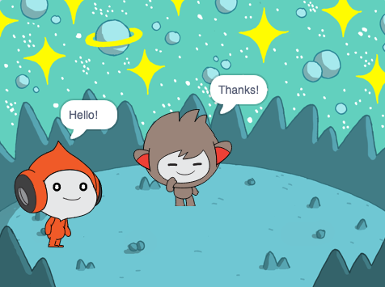

## The Nano sprite switches costumes

You will get the **Nano** sprite to emote by switching **costumes**.

Sprites have **costumes** to change the way that they look. You can animate a sprite by changing its costumes.

<div style="display: flex; flex-wrap: wrap">
<div style="flex-basis: 200px; flex-grow: 1; margin-right: 15px;">
{:width="300px"}
</div>
</div>

--- task ---

Add the **Nano** sprite to your project from the **Fantasy** category.


--- /task ---

--- task ---

Click on the **Costumes** tab to see the costumes for the **Nano** sprite:


--- /task ---

--- task ---

Go back to the **Code** tab, open the `Looks`{:class="block3looks"} blocks menu, and drag a `switch costume to`{:class="block3looks"} block to the Code area.

Try changing the selected costume: click on `nano-a`{:class="block3looks"} and choose another costume such as `nano-d`{:class="block3looks"} from the drop-down menu. Click on the block to see the **Nano** sprite's costume change on the Stage:


--- /task ---

You can create new costumes for your sprites with the Paint editor. You will make a costume of the **Nano** sprite with one hand up to its mouth. 

--- task ---

Click on the **Costumes** tab, then right-click (or on a tablet, tap and hold) on the **nano-a** costume and choose **duplicate**. You will now have a **nano-a2** costume.


--- /task ---

--- task ---

Click on the arm on the left-hand side and then click on **Delete**.


The costume should look like this:


--- /task ---

**Tip:** If you make a mistake in the Paint editor, you can click on **Undo**.


--- task ---

Go to the **nano-c** costume and click on the arm on the left-hand side, then click on **Copy**.


--- /task ---

--- task ---

Go back to the **nano-a2** costume and click on **Paste**. The costume should look like this:


--- /task ---

--- task ---

Now, switch to the **Code** tab and change your code to make the **Nano** sprite `say`{:class="block3looks"} `Thanks!`:


```blocks3
when this sprite clicked
switch costume to [nano-a2 v] // hand goes to mouth
say [Thanks!] for [2] secs // try 1 instead of 2
switch costume to [nano-a v] // Nano smiles
```
--- /task ---

**Tip:** All the blocks are colour-coded, so you will find the `switch costume to`{:class="block3looks"} block in the `Looks`{:class="block3looks"} blocks menu.

--- task ---

**Test:** Click on the **Nano** sprite on the Stage to see the sprite say "Thanks!" with words and costume changes.

--- /task ---

<p style="border-left: solid; border-width:10px; border-color: #0faeb0; background-color: aliceblue; padding: 10px;">Millions of people use sign language to communicate. You have just coded the **Nano** sprite to use a popular sign for 'thank you'. Next time you say thank you to someone, why not use your new skill?
</p>

--- save ---
