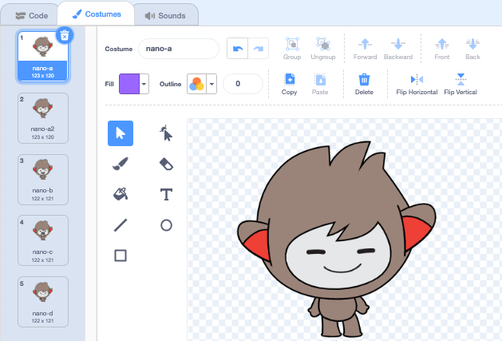
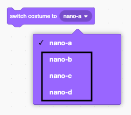
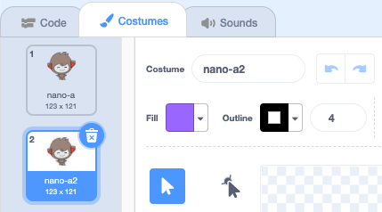
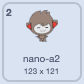
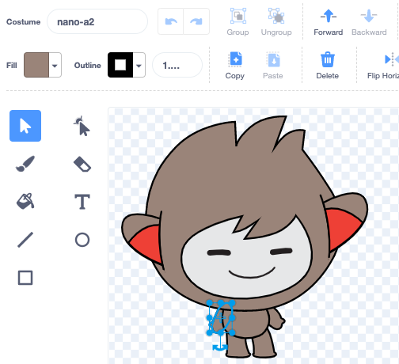
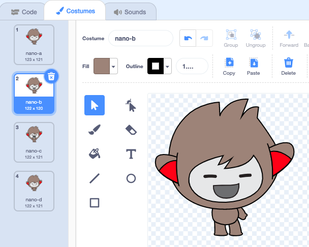
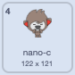
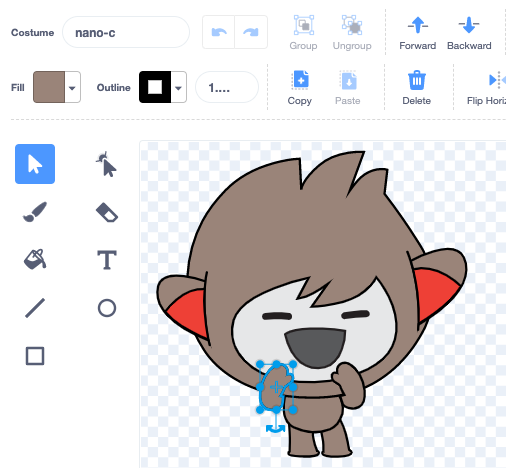
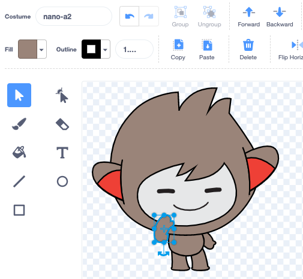

## Nano switches costume

Sprites have costumes to change the way they look.

--- task ---
Add the **Nano** sprite to your project.
--- /task ---

--- task ---
Click on the **Costumes** tab to see the costumes for the **Nano** sprite. 

--- /task ---

--- task ---
Go back to the **Code** tab and drag a `switch costume to`{:class="block3looks"} block to the Code area. 

Try changing the selected costume by clicking on **nano-a** and choosing another costume from the menu. Click on the block to see Nano's costume change on the stage:




--- /task ---

--- task ---
You can also change costumes with the Paint editor. You are going to make a costume with one hand up to Nano’s mouth. 

Click on the **Costumes** tab then right-click on the **nano-a** costume and choose 'duplicate'. You will now have a **nano-a2** costume.




--- /task ---

--- task ---
Click on the arm on the left and then click **Delete**. 





The costume should look like this:


*Tip*: If you make a mistake in the Paint editor you can click Undo 
--- /task ---

--- task ---
Go to the **nano-c** costume and click on the arm on the left then click **Copy**. 





--- /task ---

--- task ---
Go back to the **nano-a2** costume and click on **Paste**. 
The costume should look like this:




--- /task ---

--- task ---
Now switch to the **Code** tab and change your code to make the **Nano** sprite `say`{:class="block3looks"} 'Thanks!':


```blocks3
when this sprite clicked
switch costume to [nano-a2 v] // hand to mouth
say [Thanks!] for [2] secs // try 1 instead 
switch costume to [nano-a v] // smiling
```
--- /task ---

*Tip*: All the blocks are colour coded so you will find the `change costume to`{:class="block3looks"} block in the `Looks`{:class="block3looks"} Blocks menu.

**Boxout** 
Over 100,000 people use the language 'Makaton' to communicate using signs and symbols. You have just coded the **Nano** sprite to use the Makaton sign for 'thank you.' Next time you say thank you to someone why not use your new skill to say it in Makaton.

--- save ---
