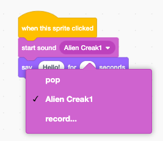

## Pico plays a sound

<div style="display: flex; flex-wrap: wrap">
<div style="flex-basis: 200px; flex-grow: 1; margin-right: 15px;">
Another way to communicate is to use sound.
</div>
<div>

{:width="300px"}

</div>
</div>

--- task ---

Click on the **Sounds** tab for the **Pico** sprite and you will find a **pop** sound. Click on the **Play** icon to hear the **pop** sound.


--- /task ---

There are some fantastic alien sounds in Scratch that you can add to your sprite.

--- task ---

To choose a new sound, click on the **Choose a Sound** icon and select the **Space** category or type `space` in the search box.


--- /task ---

--- task ---

Play a few different sounds using the **Play** icons. Once you have found the sound that you want to use, click on it to add it to your project.


--- /task ---

--- task ---

Click on the **Code** tab. In the `Sound`{:class="block3sound"} blocks menu, find the `start sound`{:class="block3sound"} block. 

Drag the block into the Code area, between the `when this sprite clicked`{:class="block3events"} block and the `say`{:class="block3looks"} block. A gap will open up and the block will snap into place.


Your code should look like this:


```blocks3
when this sprite clicked
+start sound [Alien Creak1 v] 
say [Hello!] for [2] seconds // hide speech after 2 seconds
```

--- /task ---

--- task ---

Check that your `start sound`{:class="block3sound"} block has your chosen sound in it. If it does not, you need to click on the sound in the `start sound`{:class="block3sound"} block, then select your chosen sound in the drop-down menu.



--- /task ---

--- task ---

**Test:** Click on the **Pico** sprite and check that the speech bubble appears and you can hear the sound. If you do not hear the sound, make sure that you have added the `start sound`{:class="block3sound"} block under the `when this sprite clicked`{:class="block3events"} block. Also, check that the sound is working on your computer or tablet.

--- /task ---

--- save ---

