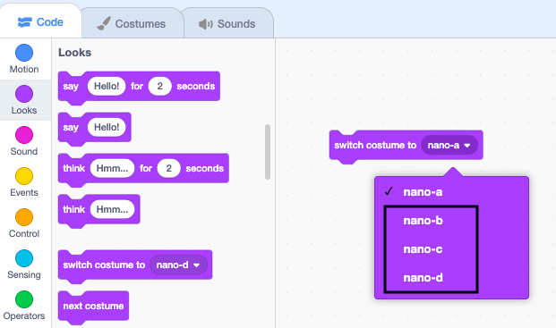
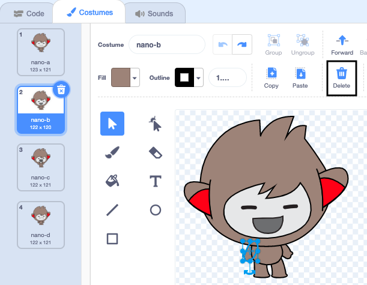
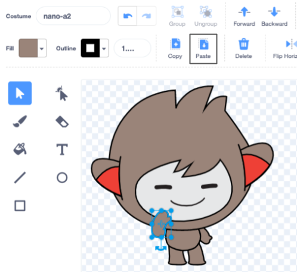

## Nano switches costumes

Sprites have costumes to change the way they look. You can animate a sprite by changing its costumes.

Change Nano's costume with code blocks.

--- task ---

Add the **Nano** sprite to your project.

--- /task ---

--- task ---

Click on the **Costumes** tab to see the costumes for the **Nano** sprite:


--- /task ---

--- task ---

Go back to the **Code** tab and drag a `switch costume to`{:class="block3looks"} block to the Code area.

Try changing the selected costume by clicking on **nano-a** and choosing another costume from the menu. Click on the block to see Nano's costume change on the stage:





--- /task ---

You can also create costumes for your Sprites with the Paint editor. You are going to make a costume with one hand up to Nano’s mouth. Changing this costume makes Nano's arm move.

--- task ---

Click on the **Costumes** tab then right-click on the **nano-a** costume and choose `duplicate`. You will now have a **nano-a2** costume.


--- /task ---

--- task ---

Click on the arm on the left and then click **Delete**.




The costume should look like this:


--- /task ---

*Tip*: If you make a mistake in the Paint editor you can click Undo 

--- task ---

Go to the **nano-c** costume and click on the arm on the left then click **Copy**.


--- /task ---

--- task ---

Go back to the **nano-a2** costume and click on **Paste**. The costume should look like this:




--- /task ---

--- task ---

Now switch to the **Code** tab and change your code to make the **Nano** sprite `say`{:class="block3looks"} `Thanks!`:


```blocks3
when this sprite clicked
switch costume to [nano-a2 v] // hand to mouth
say [Thanks!] for [2] secs // try 1 instead of 2
switch costume to [nano-a v] // smiling
```
--- /task ---

**Tip:** All the blocks are colour coded so you will find the `change costume to`{:class="block3looks"} block in the `Looks`{:class="block3looks"} Blocks menu.

--- task ---

**Test:** Click on Nano to see the sprite say "Thanks!" with words and costume changes.

--- /task ---

<p style="border-left: solid; border-width:10px; border-color: #0faeb0; background-color: aliceblue; padding: 10px;">Millions of people use sign language to communicate. You have just coded the **Nano** sprite to use a popular sign for 'thank you.' Next time you say thank you to someone, why not use your new skill!
</p>

--- save ---
