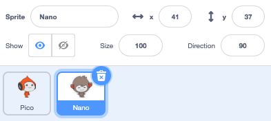

## Nano switches costume

<div style="display: flex; flex-wrap: wrap">
<div style="flex-basis: 200px; flex-grow: 1; margin-right: 15px;">

Get Nano to emote by switching **costumes**.

Sprites have **costumes** to change the way that they look. They are usually slightly different images of the same sprite. To animate a sprite, you can change its costume.

</div>
<div>

{:width="300px"}

</div>
</div>

--- task ---

Add the **Nano** sprite to your project from the **Fantasy** category.


--- /task ---

--- task ---

Make sure that the **Nano** sprite is selected in the Sprite list below the Stage. 



Click on the **Code** tab and add a script to get the **Nano** sprite to change costume using `switch costume to`{:class="block3looks"} and `wait`{:class="block3control"}. Use the drop down menu to switch between `nano-b`{:class="block3looks"} and `nano-a`{:class="block3looks"}:


```blocks3
when this sprite clicked // when Nano is clicked
switch costume to (nano-b v) // Nano talking
wait (0.5) seconds // try 0.25 instead of 0.5
switch costume to (nano-a v) // Nano smiling
```
--- /task ---

**Tip:** All the blocks are colour-coded, so you will find the `switch costume to`{:class="block3looks"} block in the `Looks`{:class="block3looks"} blocks menu and the `wait`{:class="block3control"} block in the `Control`{:class="block3control"} blocks menu.

--- task ---

**Test:** Click on the **Nano** sprite on the Stage and check that Nano's costume changes.

--- /task ---
