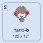

## Nano switches costumes

You will get Nano to emote by switching **costumes**.

Sprites have **costumes** to change the way that they look. You can animate a sprite by changing its costumes.

<div style="display: flex; flex-wrap: wrap">
<div style="flex-basis: 200px; flex-grow: 1; margin-right: 15px;">
{:width="300px"}
</div>
</div>

--- task ---

Add the **Nano** sprite to your project from the **Fantasy** category.


--- /task ---

--- task ---

Make sure **Nano** is selected under the Stage. Click on the **Code** tab and add a script to `say`{:class="block3looks"} `Thanks!`:


```blocks3
when this sprite clicked // when Nano is clicked
switch costume to [nano-b v] // Nano talking
say [Thanks!] for [2] secs // try 1 instead of 2
switch costume to [nano-a v] // Nano smiles
```
--- /task ---

**Tip:** All the blocks are colour-coded, so you will find the `switch costume to`{:class="block3looks"} block in the `Looks`{:class="block3looks"} blocks menu.

--- task ---

**Test:** Click on the **Nano** sprite on the Stage to see the sprite say "Thanks!".

--- /task ---

<p style="border-left: solid; border-width:10px; border-color: #0faeb0; background-color: aliceblue; padding: 10px;">Millions of people use sign language to communicate. A common sign for 'thank you' is bringing your right hand up to your mouth. 
</p>

You can edit costumes for your sprites with the Paint editor. You will edit a costume of Nano to make one with one hand up to their mouth. 

--- task ---

Click on the **Costumes** tab to see the costumes for the **Nano** sprite:


--- /task ---

--- task ---

Click on the **nano-b** costume. Click on the arm on the left-hand side and then click on **Delete**.




The costume should look like this:


--- /task ---

**Tip:** If you make a mistake in the Paint editor, you can click on **Undo**.


--- task ---

Go to the **nano-c** costume and click on the arm on the left-hand side, then click on **Copy**.


--- /task ---

--- task ---

Go back to the **nano-b** costume and click on **Paste**. The costume should look like this:


--- /task ---

--- task ---

**Test:** Click on the **Nano** sprite on the Stage to see the sprite say "Thanks!" with words and costumes.

--- /task ---

--- save ---
