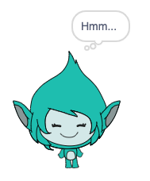

## Giga changes colour

Sprites can also use thought bubbles and change colours to show their personality. You will get Giga to do this.




--- task ---
Add the Giga sprite. 

Drag Giga to the right of the Stage.
--- /task ---

--- task ---
Make sure you have Giga selected in the sprite list under the Stage. Add this code to make Giga communicate by changing colour. 


```blocks3
when this sprite clicked
set [color v] effect to [0] // 0 is the normal colour
think [Hmm...] for [2] secs 
clear graphic effects // back to normal colour
```

--- /task ---

**Tip:** Click on the sprite in the sprite list under the Stage before adding or changing code, costumes, or sound. Make sure you have clicked the right sprite.

--- task ---
Try different numbers from 1 to 200 in the `set color effect`{:class="block3looks"} block until you find a colour you like. 
--- /task ---

--- task ---
Change the words and number of seconds in the `think`{:class="block3looks"} block.
--- /task ---

--- save ---
