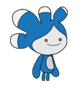

## Upgrade your project

<div style="display: flex; flex-wrap: wrap">
<div style="flex-basis: 200px; flex-grow: 1; margin-right: 15px;">
Add the **Tera** sprite and use any of the blocks that you have learned about to make an 'emote' for the **Tera** sprite.
</div>
<div>

{:width="300px"}

</div>
</div>

The **Tera** sprite's personality is your choice, so have fun using your own creative ideas.

```blocks3
when this sprite clicked

say [Hello!] for [2] seconds

say [Hello!]

say [] // hide speech bubble

think [Hmm...] for [2] seconds

switch costume to [tera-d v]

set [color v] effect to [0] // number up to 200

clear graphic effects

play sound [pop v] until done

start sound [pop v]
```

You can also 'remix' the project to make any changes you like. You could change the backdrop, and how the sprites emote, and even choose different sprites and give them emotes.

**Tip:** Click on a sprite in the Sprite list below the Stage to change the code, costumes, and sound for that sprite. 

--- collapse ---
---
title: Space talk certificate
---

Well done! You have completed the Space talk project. Here is [a certificate](https://drive.google.com/file/d/18xx4uNIyRSty_2ujHkGDzGwTgfSGC1AF/view?usp=sharing){:target="_blank"} to celebrate your new skills. Download a copy then open it to add your name. 

--- /collapse ---

--- collapse ---
---
title: Completed project
---

You can view the [completed project here](https://scratch.mit.edu/projects/485673032/){:target="_blank"}.

--- /collapse ---

--- save ---
