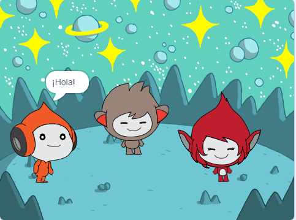

## What you will make

En este proyecto, crearás una escena espacial con personajes 👾 que se 'emocionan' para compartir sus pensamientos o sentimientos.

En Scratch, los personajes y cosas se llaman **objetos** y aparecen en el **escenario**.

Vas a:
+ Agregar objetos y un **fondo** para configurar tu proyecto
+ Haz clic en los objetos para que se comuniquen usando `apariencia`{:class="block3looks"} y `sonido`{:class="block3sound"}
+ Usa el **editor de dibujo** para cambiar un **disfraz**

--- no-print --- --- task ---
### Reproducir ▶️

  
Haz clic en cada objeto para ver qué hacen. 

¿Qué sucede si haces clic en un objeto y luego rápidamente haces clic en otro?

  <iframe allowtransparency="true" width="485" height="402" src="https://scratch.mit.edu/projects/embed/485673032/?autostart=false" frameborder="0"></iframe>

--- /task --- --- /no-print ---

--- print-only ---

--- /print-only ---

