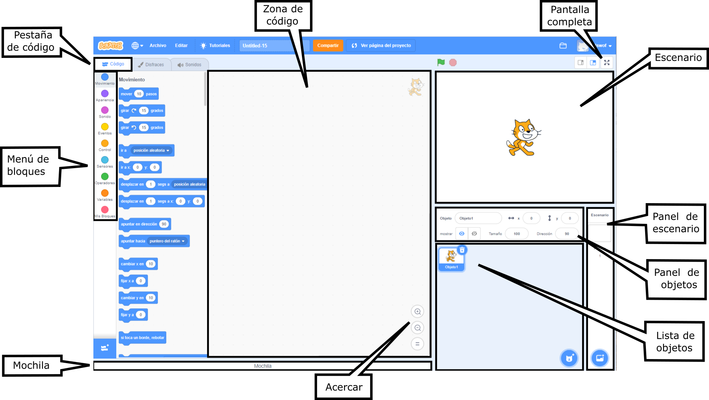
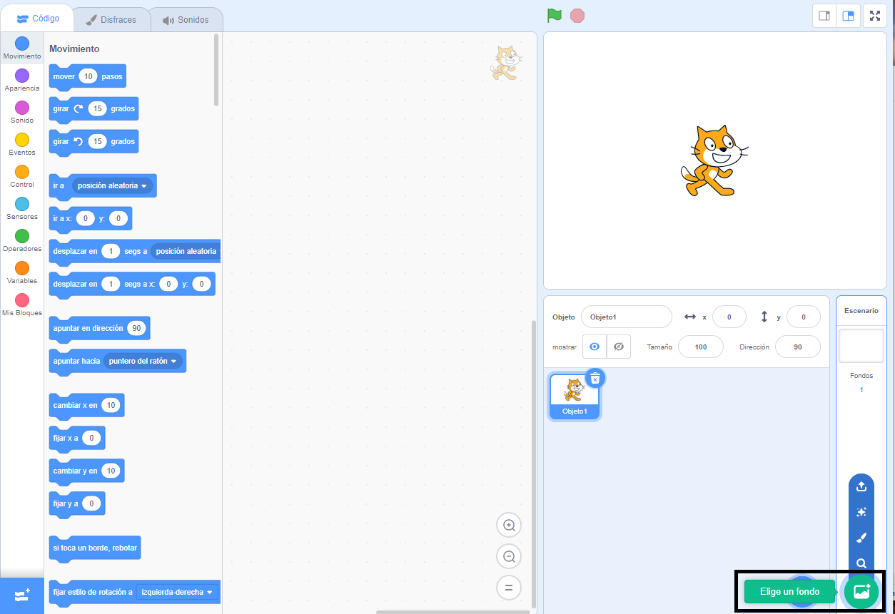
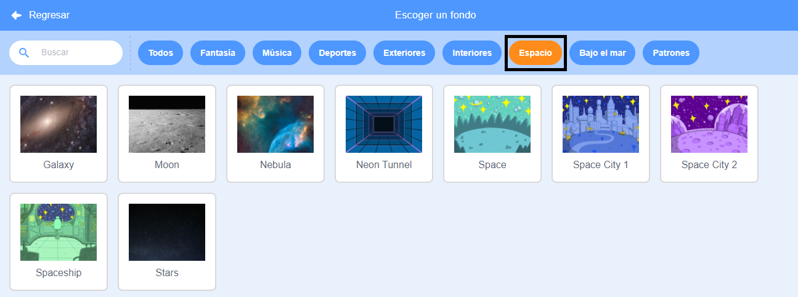
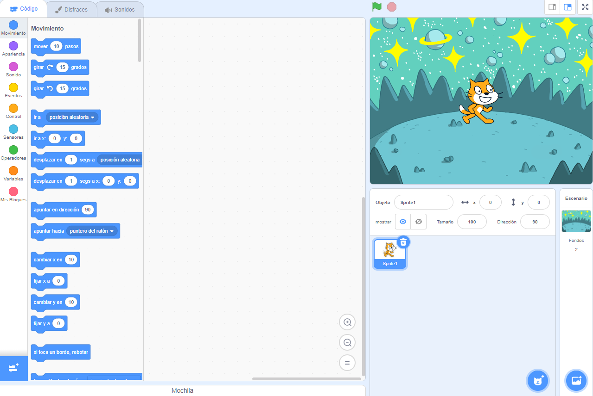
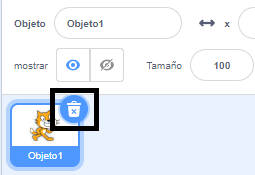
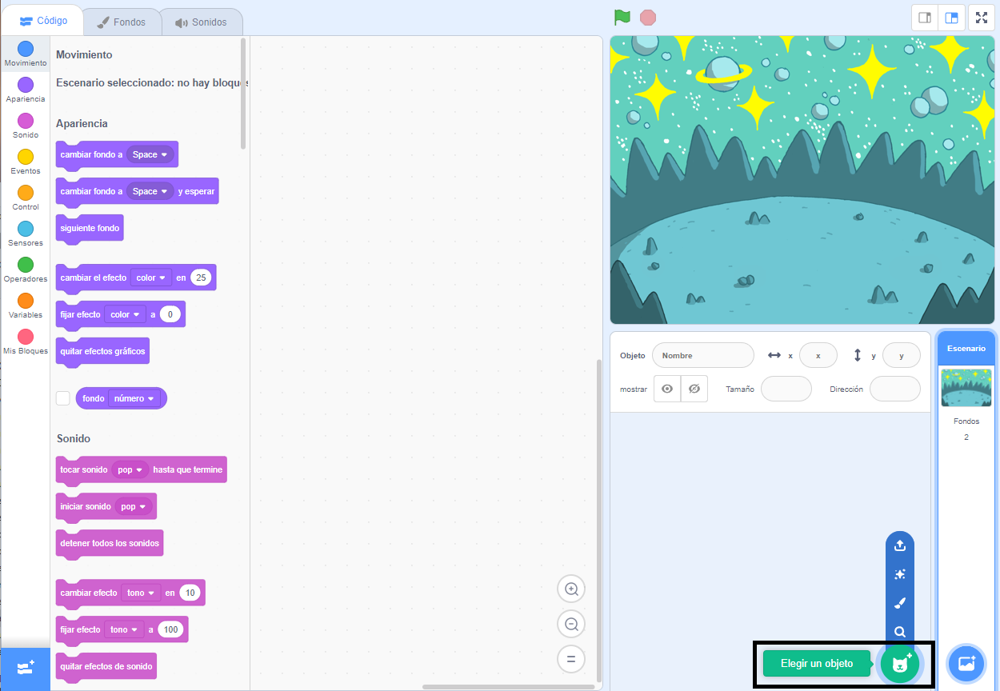
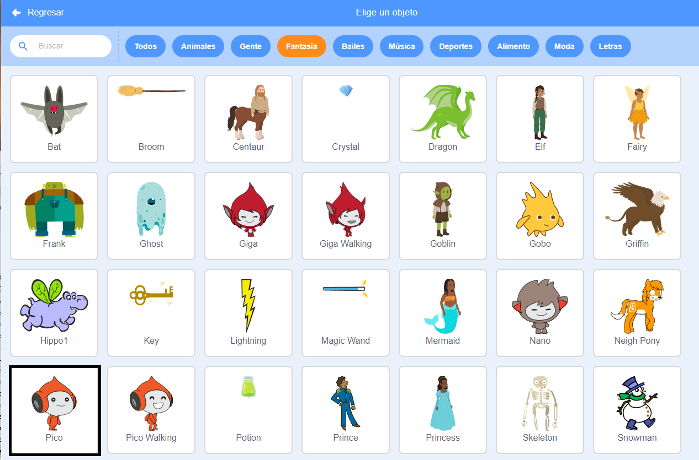
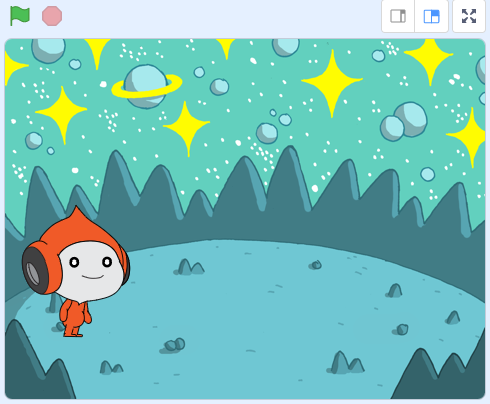
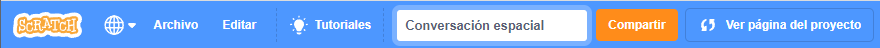

## Crea tu escena

En este paso, configurarás tu proyecto con un fondo espacial y el primer objeto. 

![El fondo Space con el objeto Pico.] (images/backdrop-step.png) {:width="300px"}

--- task ---

Abre el [proyecto de inicio de Conversación espacial](https://scratch.mit.edu/projects/582213331/editor){:target="_blank"}. Scratch se abrirá en otra pestaña del navegador.

[[[working-offline]]]

--- /task ---

El editor de Scratch se ve así:

El **Escenario** es donde se ejecuta tu proyecto. Un **fondo** cambia la apariencia del escenario.

--- task ---

Haz clic (o toca, en una tableta) en **Elije un fondo** en el panel del Escenario:

--- /task ---

--- task ---

Haz clic en la categoría **Espacio** o escribe `space` en el cuadro de búsqueda:

--- /task ---

En nuestro ejemplo, hemos elegido el fondo **Space**, pero elije el fondo que más te guste.

--- task ---

Haz clic en el fondo que elegiste para agregarlo a tu proyecto. El escenario debe mostrar el fondo que elegiste:

--- /task ---

¿Puedes ver el objeto que ya está incluido en tu proyecto? Ese es el gato Scratch.

--- task ---

Elimina el **Objeto1** (el gato Scratch): selecciona el objeto **Objeto1** en la lista de objetos debajo del escenario y haz clic en el ícono **Eliminar**.

--- /task ---

--- task ---

Haz clic en **Elegir un objeto** en la lista de objetos:

--- /task ---

--- task ---

Selecciona la categoría **Fantasía**. Haz clic en el objeto **Pico** para agregarlo a tu proyecto.

--- /task ---

--- task ---

Arrastra el objeto **Pico** para colocarlo en el lado izquierdo del escenario. Tu escenario debería verse más o menos así:

--- /task ---

--- task ---

If you are signed in to your Scratch account, click on the green Remix button. This will save a copy of the project to your Scratch account.

Type the name of your project in the project name box at the top of the screen.

**Consejo:** Dale a tus proyectos nombres útiles para que puedas encontrarlos fácilmente cuando tengas muchos proyectos.

A continuación, haz clic en **Archivo**y luego en **Guardar ahora** para guardar tu proyecto.

Si no estás en línea o no tienes una cuenta Scratch, puedes hacer clic en **Guardar en tu computador** para guardar una copia de tu proyecto.

--- /task ---

