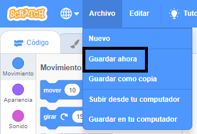

## Crea tu escena

Configura tu proyecto con un fondo espacial y el primer objeto. 

![El fondo del espacio con el objeto Pico.] (images/backdrop-step.png) {:width="300px"}

### Abre el proyecto inicial

--- task ---

Abre el [proyecto inicial de conversación espacial](https://scratch.mit.edu/projects/582213331/editor){:target="_blank"}. Scratch se abrirá en otra pestaña del navegador.

[[[working-offline]]]

--- /task ---

### El editor de Scratch

### Agrega un fondo

El **escenario** es donde se ejecuta tu proyecto. Un **fondo** cambia la apariencia del escenario.

--- task ---

Haz clic (o toca, en una tableta) en **elige un fondo** en el panel del escenario:

--- /task ---

--- task ---

Haz clic en la categoría **espacio** o escribe `space` en el cuadro de búsqueda:

--- /task ---

En nuestro ejemplo, hemos elegido el fondo **Space**, pero elige el fondo que más te guste.

--- task ---

Haz clic en el fondo que elegiste para agregarlo a tu proyecto. El escenario debe mostrar el fondo que elegiste:

--- /task ---

### Añade un objeto

¿Puedes ver el objeto que ya está incluido en tu proyecto? Ese es el gato Scratch.

--- task ---

Elimina el **Objeto1** (el gato Scratch): selecciona el objeto **Objeto1** en la lista debajo del escenario y haz clic en el ícono **eliminar**.

--- /task ---

--- task ---

Haz clic en **elegir un objeto** en la lista de objetos:

--- /task ---

--- task ---

Selecciona la categoría **fantasía**. Haz clic en el objeto **Pico** para agregarlo a tu proyecto.

--- /task ---

--- task ---

Arrastra el objeto **Pico** para colocarlo en el lado izquierdo del escenario. Tu escenario debería verse más o menos así:

--- /task ---

--- task ---

**Guardar**: Si has iniciado sesión en tu cuenta de Scratch, haz clic en el botón verde remezclar. Esto guardará una copia del proyecto en tu cuenta de Scratch.

Escribe el nombre de tu proyecto en el cuadro del nombre en la parte superior de la pantalla.

**Consejo:** Da a tus proyectos nombres útiles para que puedas encontrarlos fácilmente cuando tengas muchos proyectos.

Luego, haz clic en **archivo** y luego en **guardar ahora** para guardar tu proyecto.

Si no estás en línea o no tienes una cuenta Scratch, puedes hacer clic en **guardar en tu computador** para guardar una copia de tu proyecto.

--- /task ---

