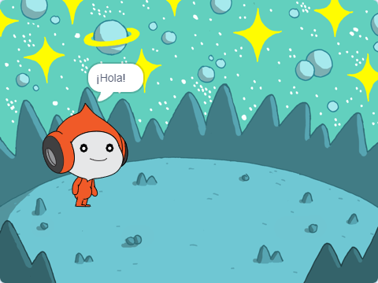
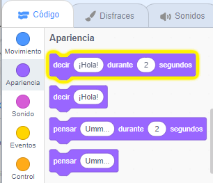
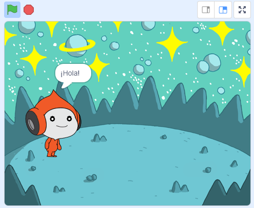
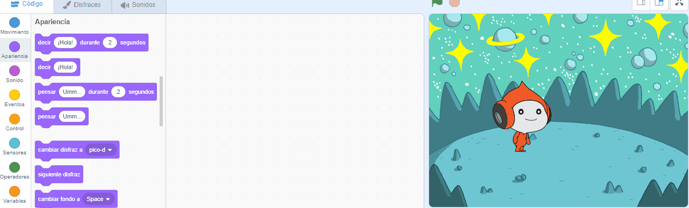
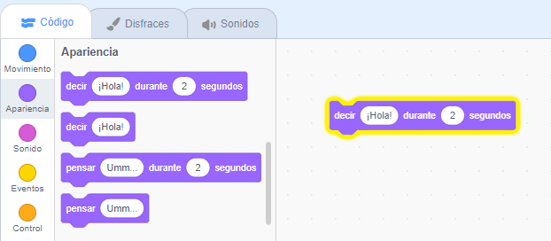
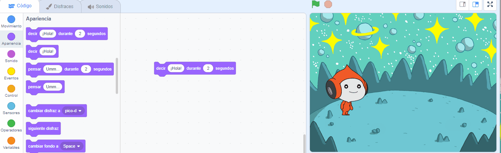

## Pico dice hola

<div style="display: flex; flex-wrap: wrap">
<div style="flex-basis: 200px; flex-grow: 1; margin-right: 15px;">
Un objeto puede tener código, disfraces y sonidos para cambiar su apariencia y lo que hace. 
  
Agregarás bloques de código para hacer que Pico reaccione con palabras y sonido cuando se haga clic en él.
</div>
<div>

{:width="300px"}

</div>
</div>

Para usar bloques, puedes hacer clic en ellos en el menú Bloques.

--- task ---

Abre el menu de bloques `Apariencia`{:class="block3looks"}.

Haz clic en el bloque `decir`{:class="block3looks"} `¡Hola!` `durante`{:class="block3looks"} `2` `segundos`{:class="block3looks"}.



El objeto **Pico** mostrará una burbuja de diálogo durante dos segundos.



**Sugerencia:** Los bloques de código en Scratch se iluminan con un contorno amarillo cuando se están ejecutando.

--- /task ---

Puedes arrastrar bloques al área de Código y desde allí se pueden usar.

--- task ---

Arrastra el bloque `decir`{:class="block3looks"} `¡Hola!` `durante`{:class="block3looks"} `2` `segundos`{:class="block3looks"} al área de Código. Vuelve a hacer clic en él.





--- /task ---

Los bloques se pueden conectar entre si en el área de Código para ejecutar más de uno a la vez. Los bloques conectados se ejecutarán en orden de arriba a abajo.

--- task ---

Arrastra un bloque `al hacer clic en este objeto` del menú `Eventos`{:class="block3events"} y conéctalo a la parte superior de tu bloque `decir`{:class="block3looks"} en el área de Código. Los bloques van a encajar.




```blocks3
+when this sprite clicked
say [Hello!] for [2] seconds // hide speech after 2 seconds
```

--- /task ---

Un comentario es una explicación de lo que hace tu código.

```blocks3
say [Hello!] for [2] seconds // hide speech after 2 seconds
```
Vas a ver comentarios en ejemplos de código. No es necesario que agregues los comentarios cuando agregas código a tu proyecto.

Si tienes tiempo cuando hayas terminado tu proyecto, es una buena idea agregar comentarios a tu código para que sea más fácil de entender más adelante. Para agregar un comentario, haz clic con el botón derecho (o en una tableta, presiona) en un bloque en el área de Código y elije **Agregar comentario**.


--- task ---

**Prueba:** Haz clic en el objeto **Pico** en el escenario y verifica que la burbuja de diálogo aparezca durante dos segundos. Es importante probar tu código para asegurarte de que hace lo que esperas.

--- /task ---

--- save ---
