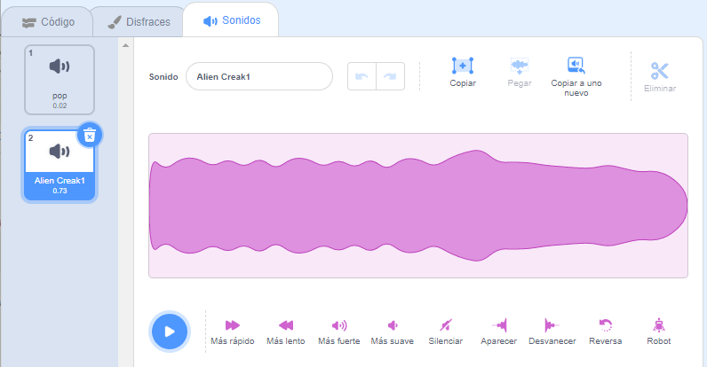

## Pico reproduce un sonido

<div style="display: flex; flex-wrap: wrap">
<div style="flex-basis: 200px; flex-grow: 1; margin-right: 15px;">
Otra forma de comunicarse es utilizar el sonido.
</div>
<div>

{:width="300px"}

</div>
</div>

### Añade un sonido al objeto Pico

--- task ---

Haz clic en la pestaña **Sonidos** para el objeto **Pico** y encontrarás el sonido **pop**. Haz clic en el triangulo **Reproducir** para escuchar el sonido **pop**.


**Debug**: Si no puedes escuchar un sonido, verifica que el sonido funciona en tu computadora o tableta.

--- /task ---

--- task ---

Para elegir un nuevo sonido, haz clic en el ícono **Elige un sonido** y selecciona la categoría **Espacio** o escribe `space` en el cuadro de búsqueda.


--- /task ---

--- task ---

Reproduce algunos sonidos diferentes usando los íconos **Reproducir**. Una vez que hayas encontrado el sonido que deseas utilizar, haz clic en él para agregarlo a tu proyecto.



--- /task ---

### Haz que el sonido se reproduzca al hacer clic (o tocar)

--- task ---

Haz clic en la pestaña **Código**. En el menú de bloques `Sonido`{:class="block3sound"}, busca el bloque `iniciar sonido`{:class="block3sound"}.

Arrastra el bloque al área de Código, entre el bloque `al hacer clic en este objeto`{:class="block3events"} y el bloque `decir`{:class="block3looks"}. Se abrirá un espacio y el bloque encajará en su lugar.


Tu código debe parecerse a esto:


```blocks3
when this sprite clicked
+start sound [Alien Creak1 v] 
say [Hello!] for [2] seconds // hide speech after 2 seconds
```

--- /task ---

### Prueba tu código

--- task ---

Comprueba que tu bloque `iniciar sonido`{:class="block3sound"} tiene el sonido que elegiste. Si no es así, debes hacer clic en el sonido en el bloque `iniciar sonido`{:class="block3sound"}, y después selecciona el sonido elegido en el menú desplegable.


--- /task ---

--- task ---

**Prueba:** Haz clic en el objeto **Pico** y verifica que la burbuja de dialogo aparece y que puedes escuchar el sonido. Si no escuchas el sonido, asegúrate de haber agregado el bloque `iniciar sonido`{:class="block3sound"} debajo del bloque `al hacer clic en este objeto`{:class="block3events"}.

--- /task ---

