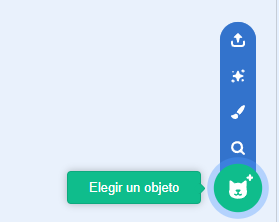
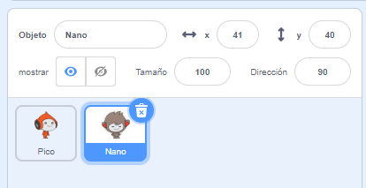
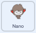
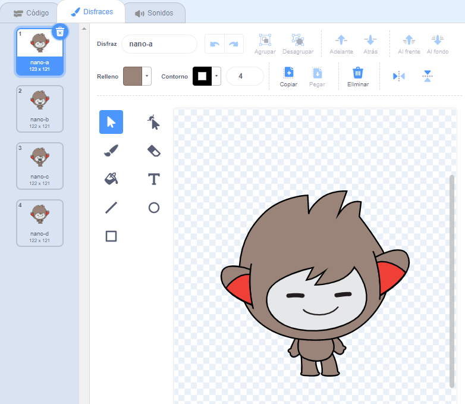
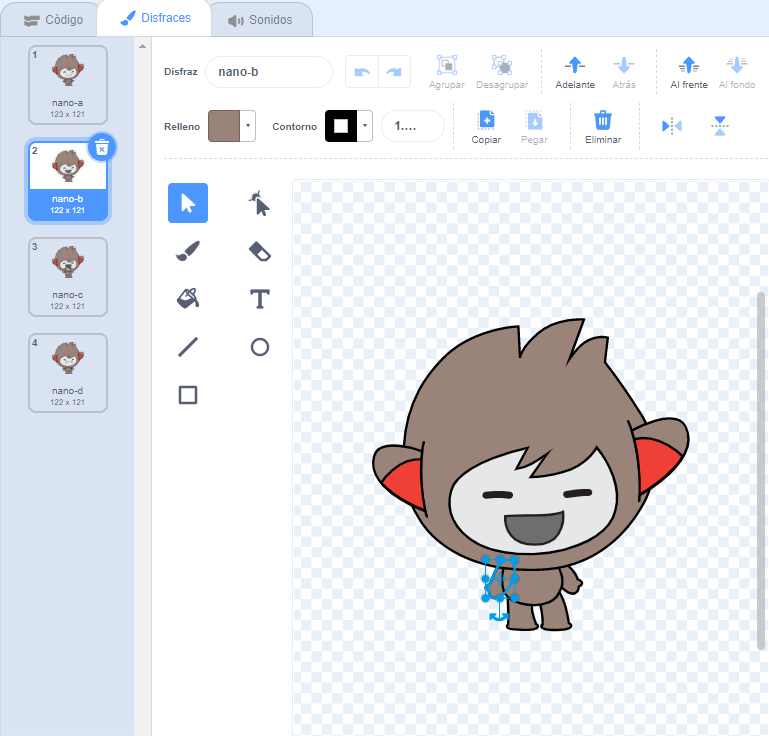
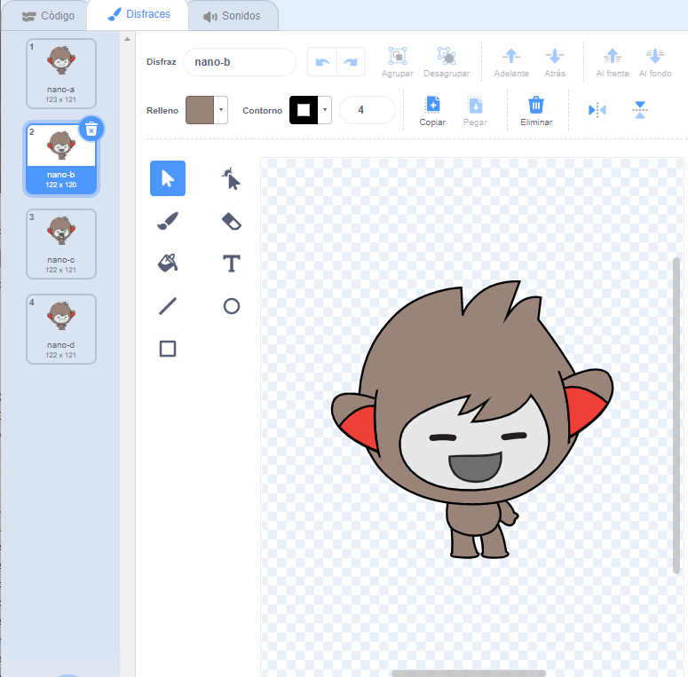
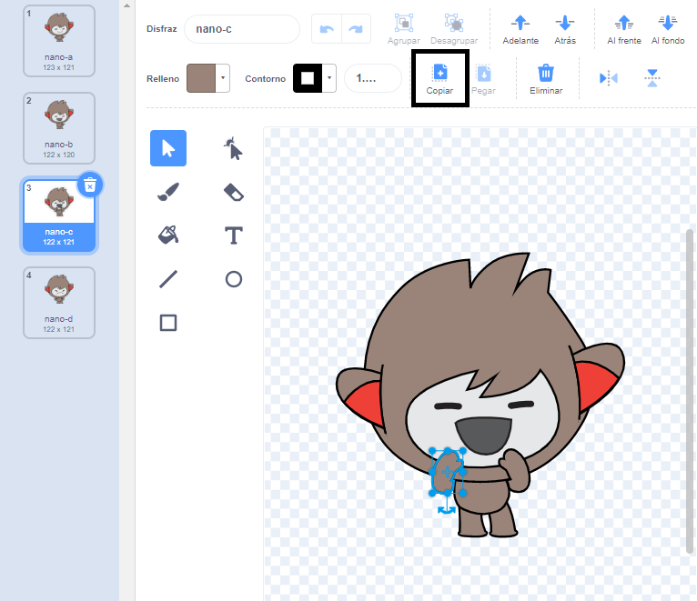
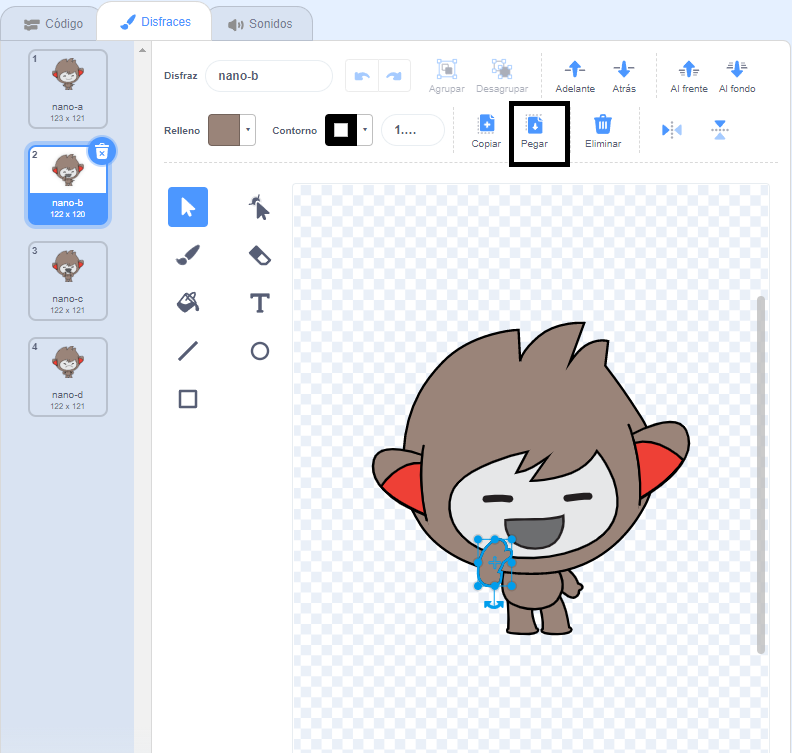

## Nano cambia de disfraz

<div style="display: flex; flex-wrap: wrap">
<div style="flex-basis: 200px; flex-grow: 1; margin-right: 15px;">

Conseguirás que Nano se exprese cambiando de **disfraces**.

Los objetos tienen **disfraces** para cambiar su apariencia. Para animar un objeto, puedes cambiar sus disfraces.

</div>
<div>

{:width="300px"}

</div>
</div>

### Nano dice "¡Gracias!"

--- task ---

Agrega el objeto **Nano** a tu proyecto de la categoría **Fantasía**.



--- /task ---

--- task ---

Asegúrate de que el objeto **Nano** esté seleccionado en la lista de objetos debajo del escenario.




Haz clic en la pestaña **Código** y agrega código para hacer que el objeto **Nano** `diga`{:class="block3looks"} `¡Gracias!`:



```blocks3
when this sprite clicked // when Nano is clicked
switch costume to [nano-b v] // Nano talking
say [Thanks!] for [2] seconds // try 1 instead of 2
switch costume to [nano-a v] // Nano smiling
```
--- /task ---

**Consejo:** Todos los bloques están codificados por colores, así que encontrarás el bloque `cambiar disfraz a`{:class="block3looks"} en el menú de bloques `Apariencia`{:class="block3looks"}.

--- task ---

**Prueba:** Haz clic en el objeto **Nano** en el escenario y verifica que aparezca la burbuja de diálogo y que Nano cambie su disfraz.

--- /task ---

### Nano usa lenguaje de señas

<p style="border-left: solid; border-width:10px; border-color: #0faeb0; background-color: aliceblue; padding: 10px;">Millones de personas utilizan el lenguaje de señas para comunicarse. Un signo común para decir 'gracias' es **llevar la mano derecha a la boca**. 
</p>

Nano usará el lenguaje de señas cambiando de disfraz.

Puedes editar los disfraces para tus sprites con el editor de dibujo. Editarás un disfraz de Nano para que diga 'gracias'.

--- task ---

Haz clic en la pestaña **Disfraces** para ver los disfraces del objeto **Nano**:



--- /task ---

--- task ---

Haz clic en el disfraz **nano-b**. Haz clic en el brazo del lado izquierdo y luego haz clic en **Eliminar**.



El disfraz debería verse así:



--- /task ---

**Consejo:** Si cometes un error en el editor de dibujos, puedes hacer clic en **Deshacer**.


--- task ---

Ve al disfraz **nano-c** y haz clic en el brazo en el lado izquierdo, luego haz clic en **Copiar**.



--- /task ---

--- task ---

Vuelve al disfraz **nano-b** y haz clic en **Pegar**. El disfraz debería verse así:



--- /task ---

--- task ---

**Prueba:** Haz clic en el objeto **Nano** en el Escenario y verifica que aparezca la burbuja de diálogo y que el disfraz de Nano cambie al disfraz que has editado.

--- /task ---

<p style="border-left: solid; border-width:10px; border-color: #0faeb0; background-color: aliceblue; padding: 10px;">Has aprendido a decir "gracias" con signos. La próxima vez que agradezcas a alguien, ¿por qué no utilizas tu nueva habilidad?
</p>

--- save ---
