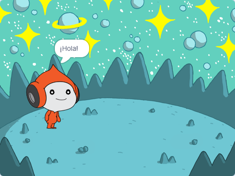

## Nano switches costume

<div style="display: flex; flex-wrap: wrap">
<div style="flex-basis: 200px; flex-grow: 1; margin-right: 15px;">

Get Nano to emote by switching **costumes**.

Los objetos tienen **disfraces** para cambiar su apariencia. To animate a sprite, you can change its costume.

</div>
<div>

{:width="300px"}

</div>
</div>

### Nano signs "Thanks!"

--- task ---

Agrega el objeto **Nano** a tu proyecto desde la categoría **Fantasía**.


--- /task ---

--- task ---

Asegúrate de que el objeto **Nano** esté seleccionado en la lista de objetos debajo del escenario.


Click on the **Code** tab and add a script to get the **Nano** sprite to sign 'Thanks' using `switch costume to`{:class="block3looks"} and `wait`{:class="block3control"}:


```blocks3
when this sprite clicked // when Nano is clicked
switch costume to [nano-b v] // Nano talking
wait (0.5) seconds // try 0.25 instead of 0.5
switch costume to [nano-a v] // Nano smiling
```
--- /task ---

**Tip:** All the blocks are colour-coded, so you will find the `switch costume to`{:class="block3looks"} block in the `Looks`{:class="block3looks"} blocks menu and the `wait`{:class="block3control"} block in the `Looks`{:class="block3control"} blocks menu.

--- task ---

**Test:** Click on the **Nano** sprite on the Stage and check that Nano's costume changes.

--- /task ---

### Nano usa lenguaje de señas

<p style="border-left: solid; border-width:10px; border-color: #0faeb0; background-color: aliceblue; padding: 10px;">Millones de personas utilizan el lenguaje de señas para comunicarse. A common way to sign 'Thank you' is to place your fingers on your chin with your hand as flat as possible. You then move your hand forwards, away from your chin and slightly down. 
</p>

<!-- Add a video of someone signing -->

Nano usará el lenguaje de señas cambiando de disfraz.

Puedes editar los disfraces para tus sprites con el editor de dibujo. Editarás un disfraz de Nano para que diga 'gracias'.

--- task ---

Haz clic en la pestaña **Disfraces** para ver los disfraces del objeto **Nano**:


--- /task ---

--- task ---

Haz clic en el disfraz **nano-b**. Haz clic en el brazo del lado izquierdo y luego haz clic en **Eliminar**.


El disfraz debería verse así:


--- /task ---

**Consejo:** Si cometes un error en el editor de dibujos, puedes hacer clic en **Deshacer**.


--- task ---

Ve al disfraz **nano-c** y haz clic en el brazo en el lado izquierdo, luego haz clic en **Copiar**.


--- /task ---

--- task ---

Vuelve al disfraz **nano-b** y haz clic en **Pegar**. El disfraz debería verse así:


--- /task ---

--- task ---

**Prueba:** Haz clic en el objeto **Nano** en el Escenario y verifica que aparezca la burbuja de diálogo y que el disfraz de Nano cambie al disfraz que has editado.

--- /task ---

<p style="border-left: solid; border-width:10px; border-color: #0faeb0; background-color: aliceblue; padding: 10px;">Has aprendido a decir "gracias" con signos. La próxima vez que agradezcas a alguien, ¿por qué no utilizas tu nueva habilidad?
</p>

