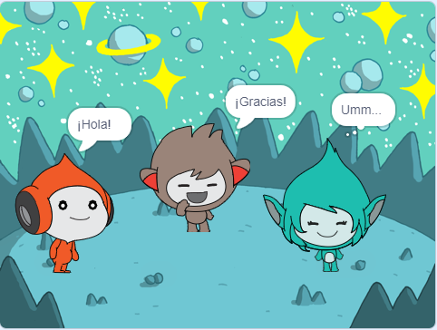

## Giga cambia de color

<div style="display: flex; flex-wrap: wrap">
<div style="flex-basis: 200px; flex-grow: 1; margin-right: 15px;">
Los objetos también pueden usar burbujas de pensamiento y cambiar sus colores para mostrar su personalidad. Vas a hacer que Giga haga eso.
</div>
<div>

{:width="300px"}

</div>
</div>

--- task ---

Agrega el objeto **Giga**.

Arrastra el objeto **Giga** al lado derecho del escenario.

--- /task ---

--- task ---

Asegúrate de tener el objeto **Giga** seleccionado en la lista de objetos debajo del escenario. Agrega este código para que el objeto **Giga** se comunique cambiando de color:


```blocks3
when this sprite clicked
set [color v] effect to [0] // el color inicial es 0
think [Umm...] for [2] seconds 
clear graphic effects // de vuelta al color inicial
```

--- /task ---

**Sugerencia:** Haz clic en el objeto en la lista de objetos debajo del escenario antes de agregar o cambiar el código, el vestuario o el sonido. Asegúrate de haber hecho clic en el objeto correcto.

--- task ---

Prueba con diferentes números del `1` al `200` en el bloque `fijar efecto color a`{:class="block3looks"} hasta que encuentres un color que te guste.

--- /task ---

--- task ---

Cambia las palabras y la cantidad de segundos en el bloque `pensar`{:class="block3looks"}.

--- /task ---

--- task ---

**Prueba:** Haz clic en el objeto **Giga** en el Escenario y verifica que el objeto cambie de color y que muestre una burbuja de pensamiento.

--- /task ---

--- save ---
