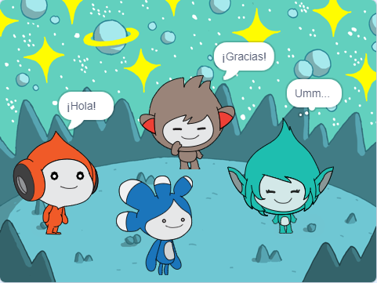

## Mejora tu proyecto

<div style="display: flex; flex-wrap: wrap">
<div style="flex-basis: 200px; flex-grow: 1; margin-right: 15px;">
Agrega el objeto **Tera** y usa cualquiera de los bloques que has aprendido para crear un 'emote' para el objeto **Tera**.
</div>
<div>

{:width="300px"}

</div>
</div>

La personalidad del objeto **Tera** es tu elección, así que diviértete usando tus propias ideas creativas.

```blocks3
when this sprite clicked

say [¡Hola!] for [2] seconds

say [¡Hola!]

say [] // esconde la burbuja de diálogo

think [Umm...] for [2] seconds

switch costume to [tera-d v]

set [color v] effect to [0] // número hasta 200

clear graphic effects

play sound [pop v] until done

start sound [pop v]
```

También puedes 'reinventar' el proyecto para realizar los cambios que desees. Podrías cambiar el fondo y las cosas que hacen los objetos, e incluso elegir diferentes objetos y darles emoticones.

**Sugerencia:** Haz clic en un objeto en la lista de objetos debajo del escenario para cambiar el código, el disfraz y el sonido de ese objeto.

--- collapse ---
---
title: Certificado de conversación espacial
---

¡Bien hecho! Has completado el proyecto Conversación espacial. Aquí tienes [un certificado](https://drive.google.com/file/d/18xx4uNIyRSty_2ujHkGDzGwTgfSGC1AF/view?usp=sharing){:target="_blank"} para celebrar tus nuevas habilidades. Descarga una copia y luego ábrela para agregar tu nombre.

--- /collapse ---

--- collapse ---
---
title: Proyecto terminado
---

Puedes ver el [proyecto terminado aquí](https://scratch.mit.edu/projects/599525747/){:target="_blank"}.

--- /collapse ---

--- save ---
