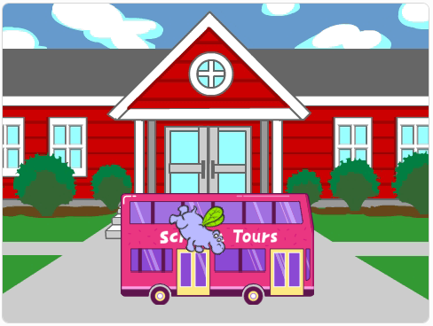

## ¿Qué sigue?

Si estás siguiendo la ruta [Introducción a Scratch](https://projects.raspberrypi.org/en/pathways/scratch-intro), puedes pasar al proyecto [Toma el autobús](https://projects.raspberrypi.org/en/projects/catch-the-bus). En este proyecto, programarás una animación con objetos que deben llegar a un autobús antes de que se vaya.

--- print-only ---

--- /print-only ---

--- no-print ---

  <iframe allowtransparency="true" width="485" height="402" src="https://scratch.mit.edu/projects/embed/724160134/?autostart=false" frameborder="0"></iframe>

--- /no-print ---

Si quieres divertirte más explorando Scratch, puedes probar cualquiera de estos [proyectos](https://projects.raspberrypi.org/en/projects?software%5B%5D=scratch&curriculum%5B%5D=%201).
