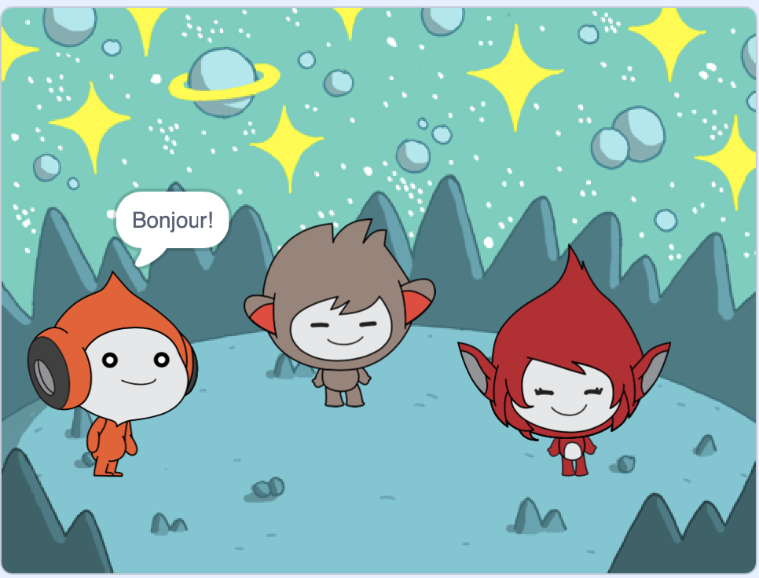

## Introduction

Dans ce projet, tu vas créer une scène spatiale avec des personnages qui « s'émeuvent » pour partager leurs pensées ou leurs sentiments.

**Les émotions** sont un moyen de montrer la personnalité d'un personnage dans un jeu. Ils peuvent utiliser la parole, les sons, les mouvements et les effets graphiques, tout comme dans Scratch. Joues-tu à des jeux qui utilisent des émotions ?

Dans Scratch, les personnages et les objets sont appelés **sprites**, et ils apparaissent sur la **Scène**.

Tu vas devoir :
+ Ajouter des sprites et un **arrière-plan** pour configurer ton projet
+ Cliquer sur les sprites pour les faire communiquer en utilisant le blocs code `apparence`{:class="block3looks"} et `son`{:class="block3sound"}
+ Utiliser l'**éditeur peinture** pour changer un **costume**

--- no-print --- --- task ---
### Essaie-le

  
Clique sur chaque sprite pour voir ce qu'ils font. 

Que se passe-t-il si tu cliques sur un sprite puis cliques rapidement sur un autre sprite ?

  <iframe allowtransparency="true" width="485" height="402" src="https://scratch.mit.edu/projects/embed/595566051/?autostart=false" frameborder="0"></iframe>

--- /task --- --- /no-print ---

--- print-only ---

--- /print-only ---

