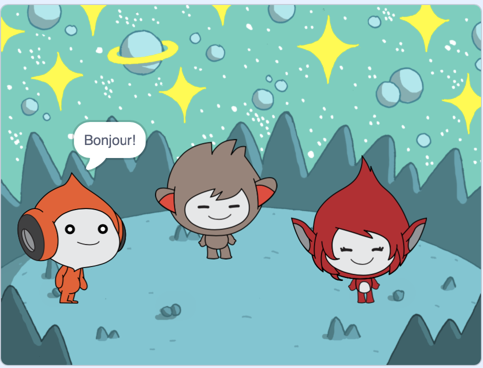

## Ce que tu feras

Crée une scène spatiale avec des personnages 👾 qui " émettent " pour partager leurs pensées ou leurs sentiments.

Dans Scratch, les personnages et les objets sont appelés **sprites**, et ils apparaissent sur la **Scène**.

Tu vas devoir :

- Ajouter des sprites et un **arrière-plan** pour configurer ton projet
- Cliquer sur les sprites pour les faire communiquer en utilisant le blocs code `apparence`{:class="block3looks"} et `son`{:class="block3sound"}
- Utiliser l'**éditeur peinture** pour changer un **costume**

> [!NOPRINT]
>
> > [!TASK]
> >
> > ### Joue ▶️
> >
> > 

> > 
  
> > Clique sur chaque sprite pour voir ce qu'ils font.
> >
> > Que se passe-t-il si tu cliques sur un sprite puis cliques rapidement sur un autre sprite ?
> >
> > 

> > 

> >   <iframe allowtransparency="true" width="485" height="402" src="https://scratch.mit.edu/projects/embed/595566051/?autostart=false" frameborder="0"></iframe>
> > 

> > 

> [!PRINTONLY]
>
> 

