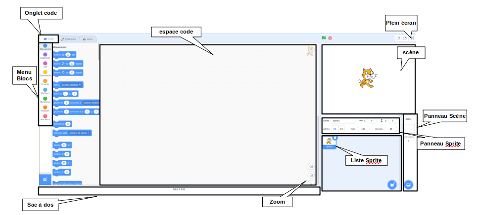
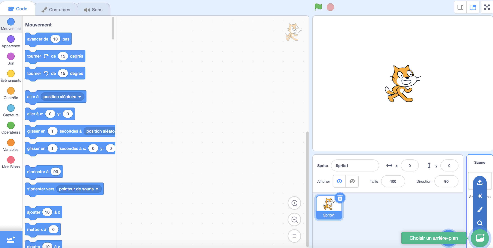
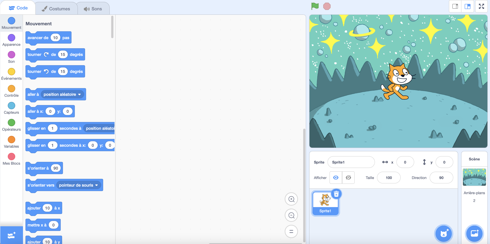
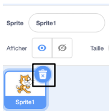
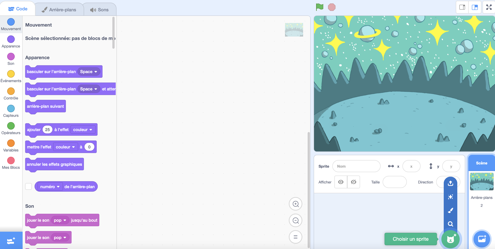
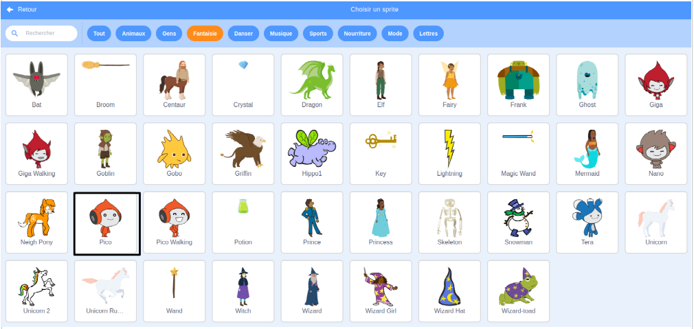
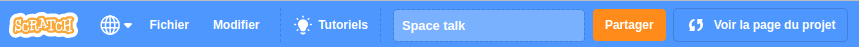
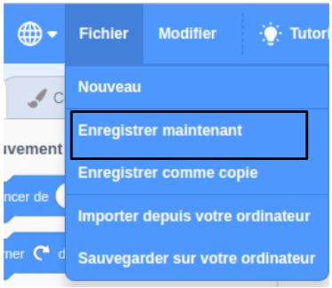

## Créer ta scène

Configure ton projet avec un arrière-plan spatial et le premier sprite. 

{:width="300px"}

### Ouvre le projet de démarrage

--- task ---

Ouvre le [projet de démarrage Space talk](https://scratch.mit.edu/projects/582213331/editor){:target="_blank"}. Scratch s'ouvrira dans un autre onglet du navigateur.

[[[working-offline]]]

--- /task ---

### L'éditeur Scratch

### Ajouter un arrière-plan

La **Scène** est l'endroit où ton projet s'exécute. Un **arrière-plan** change l'apparence de la scène.

--- task ---

Clique (ou sur une tablette, appuie) sur **Choisir un arrière-plan** dans le volet Scène :

--- /task ---

--- task ---

Clique sur **Space** ou tape `space` dans le champ de recherche :

--- /task ---

Dans notre exemple, nous avons choisi **Space**, mais choisis l'arrière-plan que tu aimes le plus.

--- task ---

Clique sur l'arrière-plan de ton choix pour l'ajouter à ton projet. La scène doit afficher l'arrière-plan que tu as choisi :

--- /task ---

### Ajouter un sprite

Peux-tu voir le sprite qui est déjà inclus dans ton projet ? C'est le chat Scratch.

--- task ---

Supprimer le sprite **Sprite1** (Chat Scratch) : sélectionne le sprite **Sprite1** dans la liste Sprite sous la scène et clique sur l'icône **Supprimer**.

--- /task ---

--- task ---

Clique sur **Choisir un Sprite** dans la liste Sprite :

--- /task ---

--- task ---

Sélectionne la catégorie **Fantaisie**. Clique sur le sprite **Pico** pour l'ajouter à ton projet.

--- /task ---

--- task ---

Fais glisser le sprite **Pico** pour le positionner sur le côté gauche de la scène. Ta scène devrait ressembler à ceci :

--- /task ---

--- task ---

Sauvegarde : si tu es connecté·e à ton compte Scratch, clique sur le bouton vert Remix. Cela enregistrera une copie du projet sur ton compte Scratch.

Tape le nom de ton projet dans la zone nom du projet en haut de l'écran.

**Astuce :** Donne à tes projets des noms utiles afin de pouvoir les retrouver facilement lorsque tu auras de nombreux projets.

Ensuite, clique sur **Fichier**, puis sur **Enregistrer maintenant** pour enregistrer ton projet.

Si tu n'es pas en ligne ou que tu n'as pas de compte Scratch, tu peux cliquer sur **Sauvegarder sur votre ordinateur** pour enregistrer une copie de ton projet.

--- /task ---

