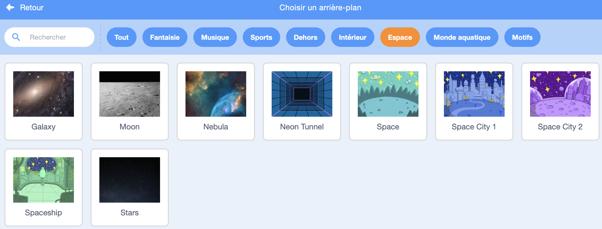

## Créer ta scène

Dans cette étape, tu vas configurer ton projet avec un fond d'espace et le premier sprite. 

{:width="300px"}

--- task ---

Ouvre le [projet de démarrage Space talk](https://scratch.mit.edu/projects/582213331/editor){:target="_blank"}. Scratch s'ouvrira dans un autre onglet du navigateur.

[[[working-offline]]]

--- /task ---

L'éditeur Scratch ressemble à ceci:

La **Scène** est l'endroit où ton projet s'exécute. Un **arrière-plan** change l'apparence de la scène.

--- task ---

Clique (ou sur une tablette, appuie) sur **Choisir un arrière-plan** dans le volet Scène :

--- /task ---

--- task ---

Clique sur l'**Espace** ou tape `espace` dans le champ de recherche :

--- /task ---

Dans notre exemple, nous avons choisi l'**Espace** , mais choisis l'arrière-plan que tu aimes le plus.

--- task ---

Clique sur l'arrière-plan de ton choix pour l'ajouter à ton projet. La scène doit afficher l'arrière-plan que tu as choisi :

--- /task ---

Peux-tu voir le sprite qui est déjà inclus dans ton projet ? C'est le chat Scratch.

--- task ---

Supprimer le sprite **sprite1** (Scratch Cat) : sélectionne le sprite **Sprite1** dans la liste Sprite sous la scène et clique sur l'icône **Supprimer**.

--- /task ---

--- task ---

Clique sur **Choisir un Sprite** dans la liste Sprite :

--- /task ---

--- task ---

Sélectionne la catégorie **Fantaisie**. Clique sur le sprite **Pico** pour les ajouter à ton projet.

--- /task ---

--- task ---

Fais glisser le sprite **Pico** pour les positionner sur le côté gauche de la scène. Ta scène devrait ressembler à ceci :

--- /task ---

--- task ---

Si tu es connecté à ton compte Scratch, clique sur le bouton vert Remix. Cela enregistrera une copie du projet sur ton compte Scratch.

Tape le nom de ton projet dans la zone nom du projet en haut de l'écran.

**Astuce :** Donne à tes projets des noms utiles afin de pouvoir les retrouver facilement lorsque tu as de nombreux projets.

Ensuite, clique sur **Fichier**, puis sur **Enregistrer maintenant** pour enregistrer ton projet.

Si tu n'es pas en ligne ou que tu n'as pas de compte Scratch, tu peux cliquer sur **Enregistrer sur ton ordinateur** pour enregistrer une copie de ton projet.

--- /task ---

