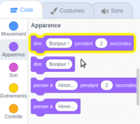
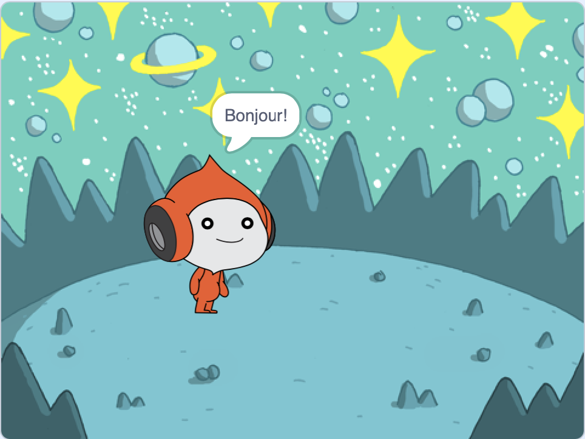
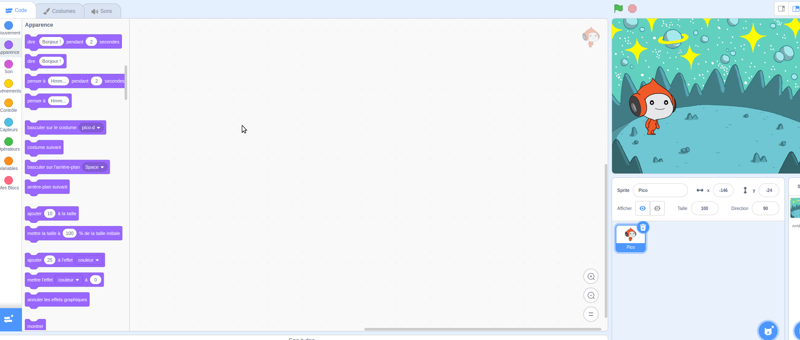
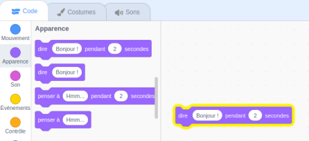
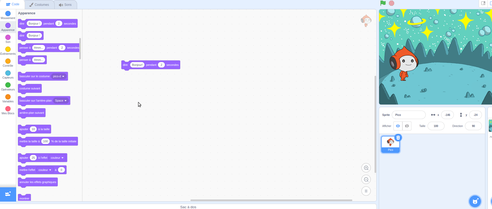
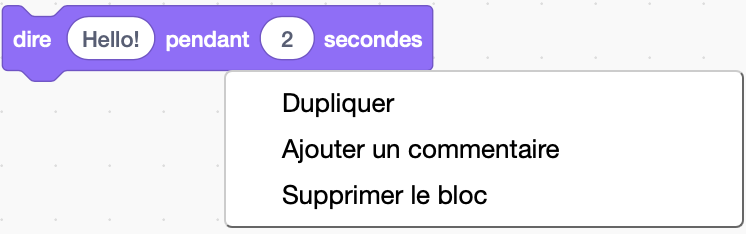

## Pico dit bonjour

<div style="display: flex; flex-wrap: wrap">
<div style="flex-basis: 200px; flex-grow: 1; margin-right: 15px;">
Un sprite peut avoir du code, des costumes et des sons pour changer son apparence et ce qu'il fait. 
  
Tu ajouteras des blocs de code pour rendre Pico émotif avec des mots et des sons lorsque tu cliques sur le sprite.
</div>
<div>

{:width="300px"}

</div>
</div>

Pour utiliser des blocs, vous pouvez cliquer dessus dans le menu Blocs.

--- task ---

Ouvre les blocs `Apparence`{:class="block3looks"}.

Clique sur un `dire`{:class="block3looks"} `Bonjour !` `pour`{:class="block3looks"} `2` `secondes`{:class="block3looks"} bloc.



Le **Pico** affichera une bulle de dialogue pendant deux secondes.



**Astuce :** blocs de code dans Scratch brillent d'un contour jaune lorsqu'ils sont en cours d'exécution.

--- /task ---

Tu peux faire glisser des blocs vers la zone Code, et ils peuvent être utilisés à partir de là.

--- task ---

Fais glisser le bloc `dire`{:class="block3looks"} `Bonjour !` `pour`{:class="block3looks"} `2` `secondes`{:class="block3looks"} dans la zone Code. Clique à nouveau dessus.





--- /task ---

Les blocs peuvent être connectés ensemble dans la zone Code pour en exécuter plusieurs à la fois. Les blocs connectés s'exécuteront dans l'ordre de haut en bas.

--- task ---

Fais glisser un `quand ce sprite est cliqué` du `blocs d'événements`{:class="block3events"} et connecte-le en haut de ton bloc `dire`{:class="block3looks" } dans la zone Code. Les blocs vont s'emboîter.




```blocks3
+when this sprite clicked
say [Bonjour !] for [2] seconds // masquer la parole après 2 secondes
```

--- /task ---

Un commentaire est une explication de ce que fait ton code.

```blocks3
say [Bonjour !] for [2] seconds // masquer la parole après 2 secondes
```
Tu verras des commentaires dans les exemples de code. Tu n'as pas besoin d'ajouter les commentaires lorsque tu ajoutes du code à ton projet.

Si tu as le temps lorsque tu as terminé ton projet, c'est une bonne idée d'ajouter des commentaires à ton code afin qu'il soit plus facile à comprendre plus tard. Pour ajouter un commentaire, fais un clic droit (ou sur une tablette, appuie et maintiens) sur un bloc dans la zone Code et choisis **Ajouter un commentaire**.



--- task ---

**Tester :** Clique sur le **Pico** sur la Scène et vérifie que la bulle de dialogue apparaît pendant deux secondes. Il est important de tester ton code pour t'assurer qu'il fait ce que tu attends.

--- /task ---

--- save ---
