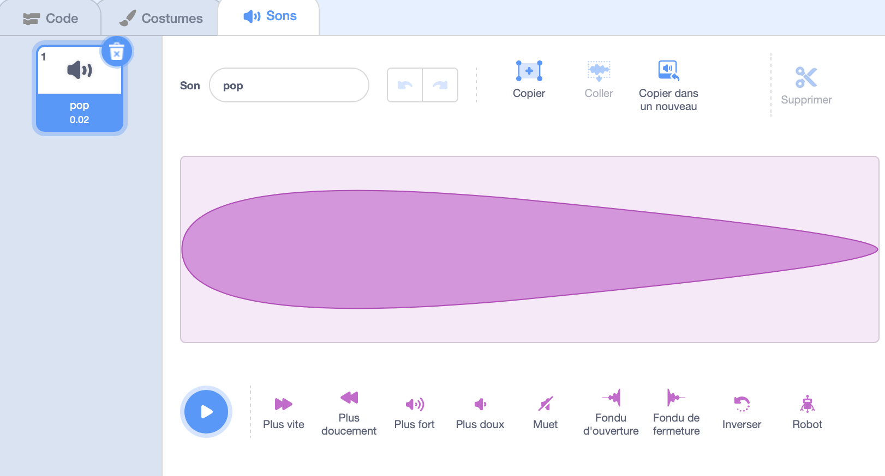
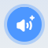
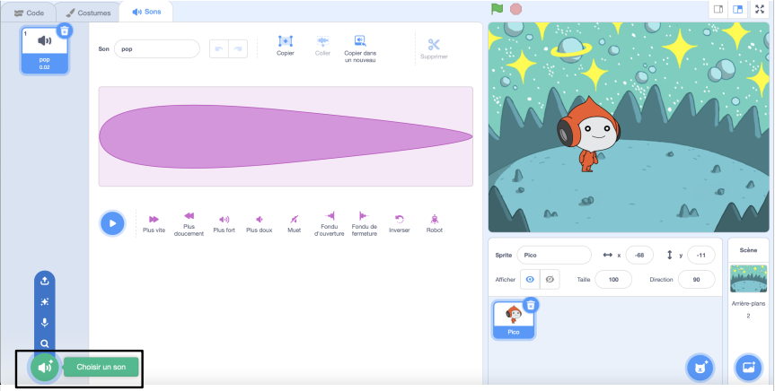
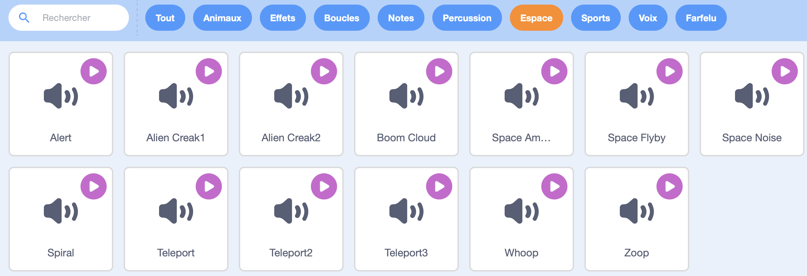
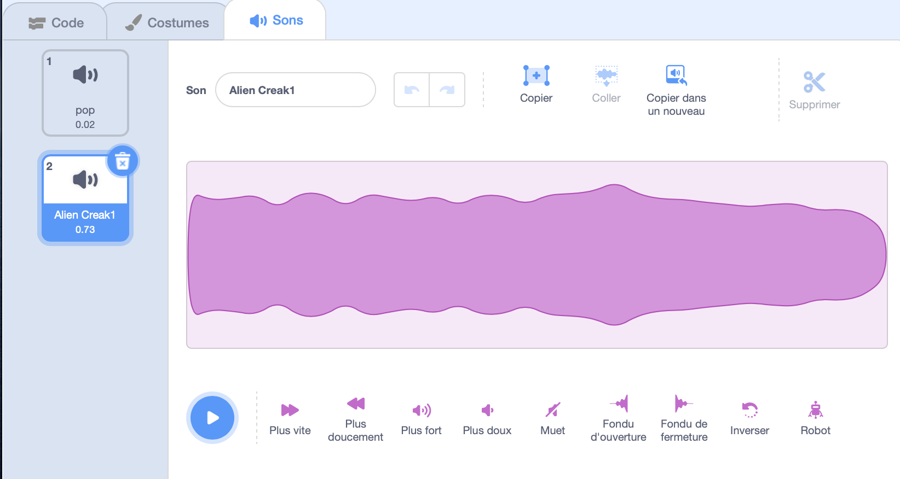
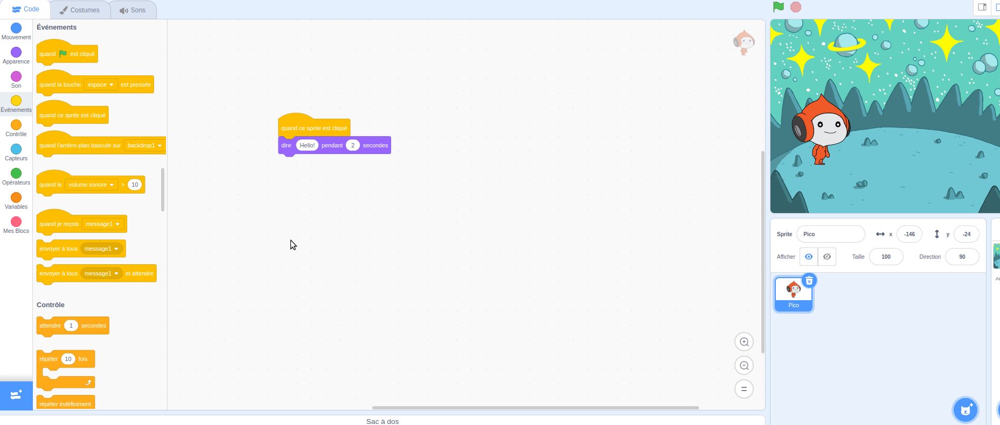
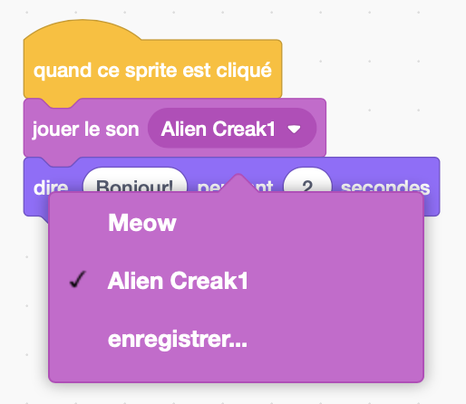

## Pico joue un son

<div style="display: flex; flex-wrap: wrap">
<div style="flex-basis: 200px; flex-grow: 1; margin-right: 15px;">
Une autre façon de communiquer est d'utiliser le son.
</div>
<div>

{:width="300px"}

</div>
</div>

--- task ---

Clique sur l'onglet **Son** pour le sprite **Pico** et tu trouveras un son **pop**. Clique sur l'icon **Jouer** pour entendre le son **pop**.



--- /task ---

Il y a des sons extraterrestres fantastiques dans Scratch que tu peux ajouter à ton sprite.

--- task ---

Pour choisir un nouveau son, clique sur **Choisir un son** et sélectionne **Espace** ou tape `espace` dans la zone de recherche.







--- /task ---

--- task ---

Joue quelques sons différents à l'aide des icônes **Jouer**. Une fois que tu as trouvé le son que tu souhaites utiliser, clique dessus pour l'ajouter à ton projet.



--- /task ---

--- task ---

Clique sur l'onglet **Code**. Dans le menu de Blocs `Son`{:class="block3sound"}, recherche le bloc `jouer le son`{:class="block3sound"}.

Fais glisser le bloc dans la zone Code, entre le bloc `quand ce sprite est cliqué`{:class="block3events"} et le bloc `dire`{:class="block3looks"}. Un espace s'ouvrira et le bloc se mettra en place.



Ton code devrait ressembler à ceci :


```blocks3
when this sprite clicked
+start sound [Alien Creak1 v] 
say [Bonjour !] for [2] seconds // masquer la parole après 2 secondes
```

--- /task ---

--- task ---

Vérifie que ton bloc `jouer le son`{:class="block3sound"} contient le son que tu as choisi. Si cela n'est pas le cas, tu dois cliquer sur le son dans le bloc `jouer le son`{:class="block3sound"}, puis sélectionner le son de ton choix dans le menu déroulant.



--- /task ---

--- task ---

**Tester :** Clique sur le **Pico** et vérifie que la bulle apparaît et que tu entends le son. Si tu n'entends pas le son, assure-toi d'avoir ajouté le bloc `jouer le son`{:class="block3sound"} sous le bloc `quand ce sprite est cliqué`{:class="block3events”} . Vérifie également que le son fonctionne sur ton ordinateur ou ta tablette.

--- /task ---

--- save ---

