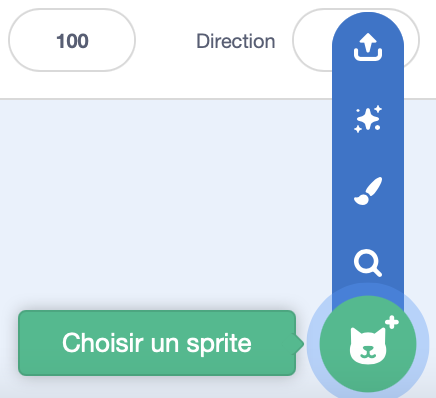
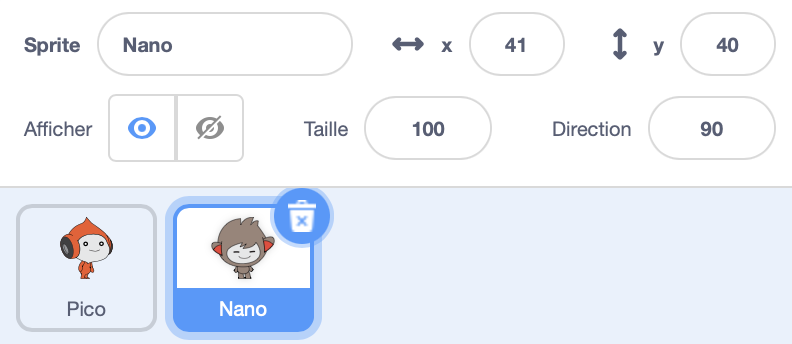
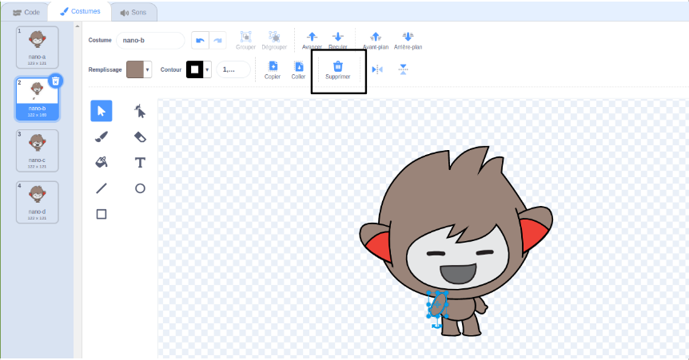
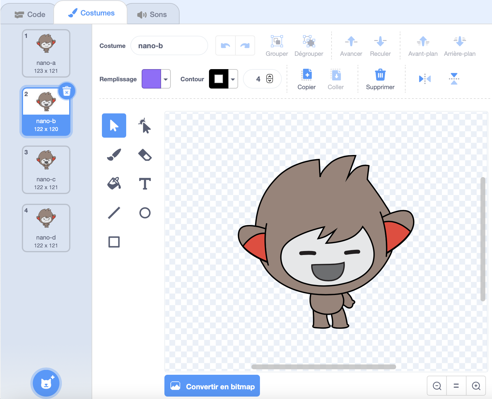
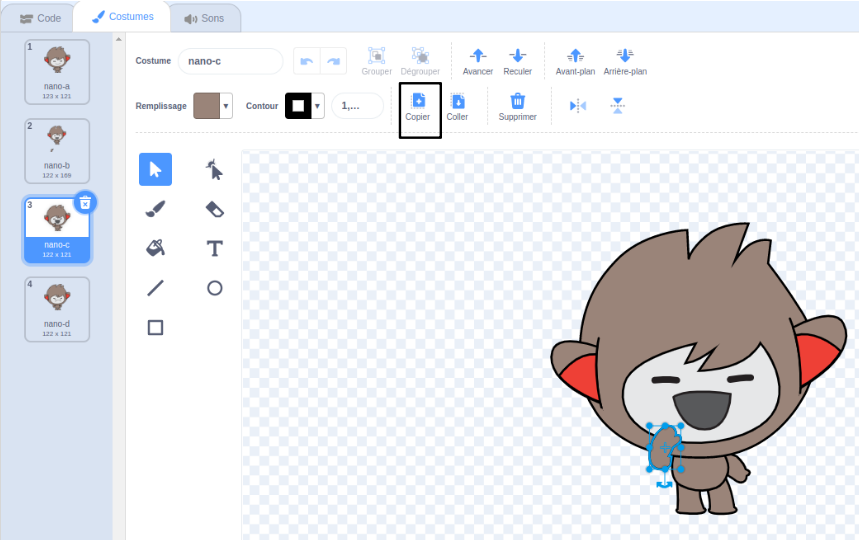
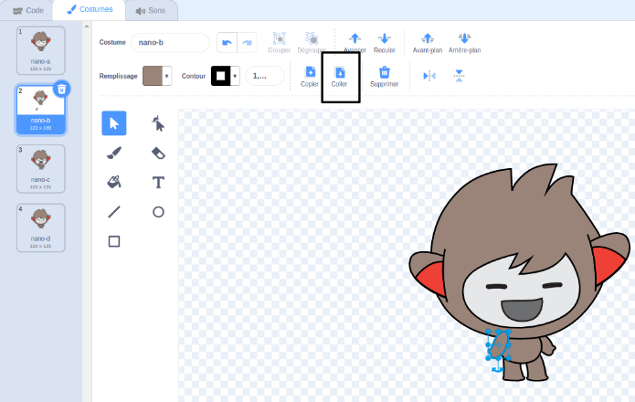

## Nano change de costume

<div style="display: flex; flex-wrap: wrap">
<div style="flex-basis: 200px; flex-grow: 1; margin-right: 15px;">

Donne une émotion à Nano en changeant de **costumes**.

Les sprites ont des **costumes** pour changer leur apparence. They are usually slightly different images of the same sprite. Pour animer un sprite, tu peux changer ses costumes.

</div>
<div>

{:width="300px"}

</div>
</div>

### Nano dit « Merci ! »

--- task ---

Ajoute le **Nano** à ton projet de la catégorie **Fantaisie**.



--- /task ---

--- task ---

Assure-toi que le sprite **Nano** est sélectionné dans la liste Sprite sous la scène.



Clique sur l'onglet **Code** et ajoute un script pour que le sprite **Nano** signe « Merci » en utilisant `basculer sur le costume`{:class="block3looks"} et `attendre`{:class="block3control"}. Use the drop down menu to switch between `nano-b`{:class="block3looks"} and `nano-a`{:class="block3looks"}:


```blocks3
when this sprite clicked // when Nano is clicked
switch costume to [nano-b v] // Nano talking
wait (0.5) seconds // try 0.25 instead of 0.5
switch costume to [nano-a v] // Nano smiling
```
--- /task ---

**Astuce :** Tous les blocs sont codés par couleur, tu trouveras donc le bloc `basculer sur le costume`{:class="block3looks"} dans le menu des blocs `Apparences`{:class="block3looks"} et le bloc `attendre`{:class="block3control"} dans le menu `Contrôles`{:class="block3control"}.

--- task ---

**Test :** Clique sur le sprite **Nano** sur la Scène et vérifie que la bulle de dialogue apparaît et que le costume de Nano change.

--- /task ---

### Nano utilise la langue des signes

<p style="border-left: solid; border-width:10px; border-color: #0faeb0; background-color: aliceblue; padding: 10px;">Des millions de personnes utilisent la langue des signes pour communiquer. Une façon courante de signer "Merci" consiste à placer ses doigts sur le menton avec la main aussi à plat que possible. Tu déplaces ensuite ta main vers l'avant, loin de ton menton et légèrement vers le bas. 
</p>

<!-- Add a video of someone signing -->

Nano utilisera la langue des signes en changeant de costume.

Tu peux modifier les costumes de tes sprites avec l'éditeur de peinture. Tu éditeras un costume de Nano pour leur faire signer « merci ».

--- task ---

Clique sur l'onglet **Costumes** pour voir les costumes du sprite **Nano**:


--- /task ---

--- task ---

Clique sur le costume **nano-b**. Clique sur le bras à gauche, puis clique sur **Supprimer**.



Le costume devrait ressembler à ceci :



--- /task ---

**Astuce :** Si tu fais une erreur dans l'éditeur de peinture, tu peux cliquer sur **Annuler**.


--- task ---

Va dans le **nano-c** et clique sur le bras à gauche, puis clique sur **Copier**.



--- /task ---

--- task ---

Reviens au **nano-b** et clique sur **Coller**. Le costume devrait ressembler à ceci :



--- /task ---

--- task ---

**Test :** Clique sur le **Nano** sur la Scène et vérifie que la bulle de dialogue apparaît et que le costume de Nano change pour le costume que tu as édité.

--- /task ---

<p style="border-left: solid; border-width:10px; border-color: #0faeb0; background-color: aliceblue; padding: 10px;">Tu as appris à signer « merci ». La prochaine fois que tu remercieras quelqu'un, pourquoi ne pas utiliser ta nouvelle compétence ?
</p>

