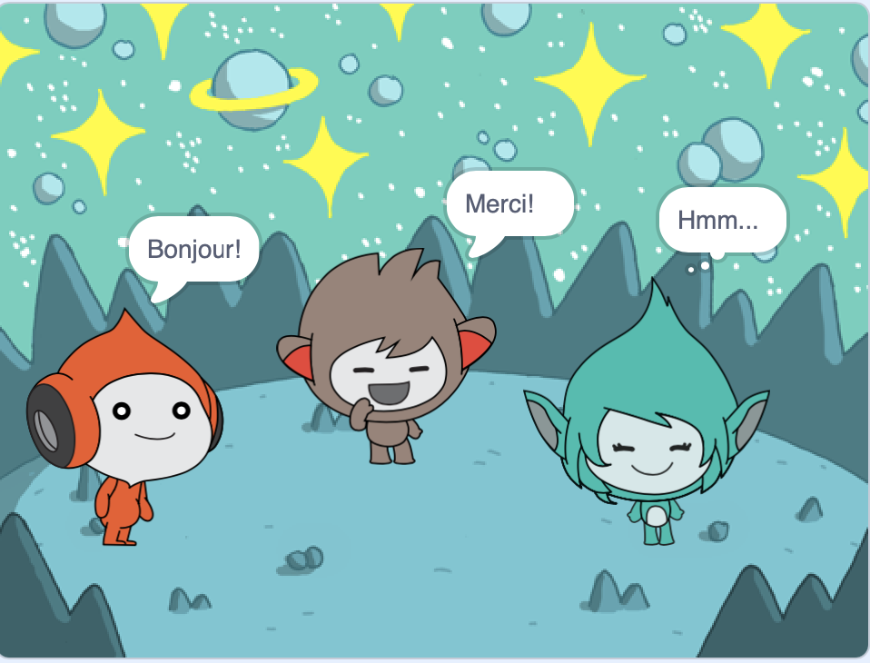

## Giga change de couleur

<div style="display: flex; flex-wrap: wrap">
<div style="flex-basis: 200px; flex-grow: 1; margin-right: 15px;">
Les sprites peuvent également utiliser des bulles de pensée et changer de couleur pour montrer leur personnalité. Tu obtiendras Giga pour le faire.
</div>
<div>

{:width="300px"}

</div>
</div>

--- task ---

Ajoute le sprite **Giga**.

Fais glisser le **Giga** sur le côté droit de la scène.

--- /task ---

--- task ---

Assure-toi que tu as le sprite **Giga** sélectionné dans la liste Sprite sous la scène. Ajoute ce code pour faire communiquer le sprite **Giga** en changeant de couleur :


```blocks3
when this sprite clicked
set [color v] effect to [0] // 0 est la couleur de départ
think [Hmm...] for [2] seconds 
clear graphic effects // retour à la couleur de départ
```

--- /task ---

**Astuce :** Clique sur le sprite dans la liste Sprite sous la scène avant d'ajouter ou de modifier le code, les costumes ou le son. Assure-toi d'avoir cliqué sur le bon sprite.

--- task ---

Essaye différents nombres de `1` à `200` dans le bloc `mettre l'effet couleur à`{:class="block3looks"} jusqu'à ce que tu trouves une couleur que tu aimes.

--- /task ---

--- task ---

Modifie les mots et le nombre de secondes dans le bloc `penser`{:class="block3looks"}.

--- /task ---

--- task ---

**Tester :** Clique sur le sprite **Giga** sur la scène et vérifie que le sprite change de couleur et affiche une bulle de pensée.

--- /task ---

--- save ---
