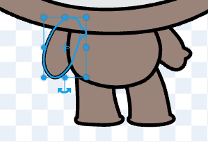
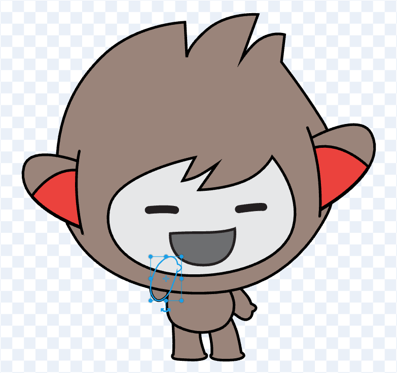

## Nano fait signe « Merci ! »

Fais que Nano fasse un signe en éditant un costume.

Des millions de personnes utilisent la langue des signes pour communiquer. Une façon courante de signer « Merci » consiste à placer tes doigts sur le menton avec ta main aussi à plat que possible. Tu déplaces ensuite ta main vers l'avant, loin de ton menton et légèrement vers le bas. 

{:width="300px"}

### Nano utilise la langue des signes

Tu éditeras un costume de Nano pour lui faire signer « merci ».

Tu peux éditer les costumes des sprites avec l'éditeur de peinture.

--- task ---

Clique sur l'onglet **Costumes** pour voir les costumes du sprite **Nano** :

--- /task ---

--- task ---

Clique sur le costume **nano-b**. Clique sur le bras sur le côté gauche.

--- /task ---

--- task ---

Sélectionne la flèche à double tête « rotation » et fais glisser la souris vers le haut pour faire pivoter le bras.

Le costume devrait ressembler à ceci :

--- /task ---

--- task ---

Choisis l'outil « Avant » pour faire du bras la couche avant.

--- /task ---

**Astuce :** Si tu fais une erreur dans l'éditeur de peinture, tu peux cliquer sur **Annuler**.

--- no-print ---

--- /no-print ---

--- task ---

**Test :** clique sur le sprite **Nano** sur la Scène et vérifie que le costume de Nano se transforme en costume que tu as modifié.

--- /task ---

Tu as appris à signer « merci ». La prochaine fois que tu remercieras quelqu'un·e, pourquoi ne pas utiliser ta nouvelle compétence ?

