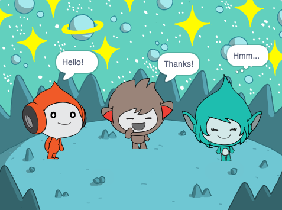

## Giga change de couleur

<div style="display: flex; flex-wrap: wrap">
<div style="flex-basis: 200px; flex-grow: 1; margin-right: 15px;">
Les sprites peuvent également utiliser des bulles de pensée et changer de couleur pour montrer leur personnalité. Tu obtiendras de Giga de faire cela.
</div>
<div>

{:width="300px"}

</div>
</div>

### Faire changer Giga de couleur

> [!TASK]
>
> Ajoute le sprite **Giga**.
>
> Fais glisser le sprite **Giga** sur le côté droit de la scène.

> [!TASK]
>
> Assure-toi que tu as sélectionné le sprite **Giga** dans la liste Sprite sous la scène. Ajoute ce code pour faire communiquer le sprite **Giga** en changeant de couleur :
>
> 
>
> ```blocks3
> when this sprite clicked
> set [couleur v] effect to [0] // 0 est la couleur de départ
> think [Hum...] for [2] seconds
> clear graphic effects // retour à la couleur de départ
> ```

**Astuce :** Clique sur le sprite dans la liste Sprite sous la scène avant d'ajouter ou de modifier le code, les costumes ou le son. Assure-toi d'avoir cliqué sur le bon sprite.

> [!TASK]
>
> Essaie différents nombres de `1` à `200` dans le bloc `ajoute à l'effet couleur`{:class="block3looks"} jusqu'à ce que tu trouves une couleur que tu aimes.

> [!TASK]
>
> Modifie les mots et le nombre de secondes dans le bloc `penser`{:class="block3looks"}.

> [!TASK]
>
> **Test :** Clique sur le sprite **Giga** sur la Scène et vérifie que le sprite change de couleur et affiche une bulle de pensée.
