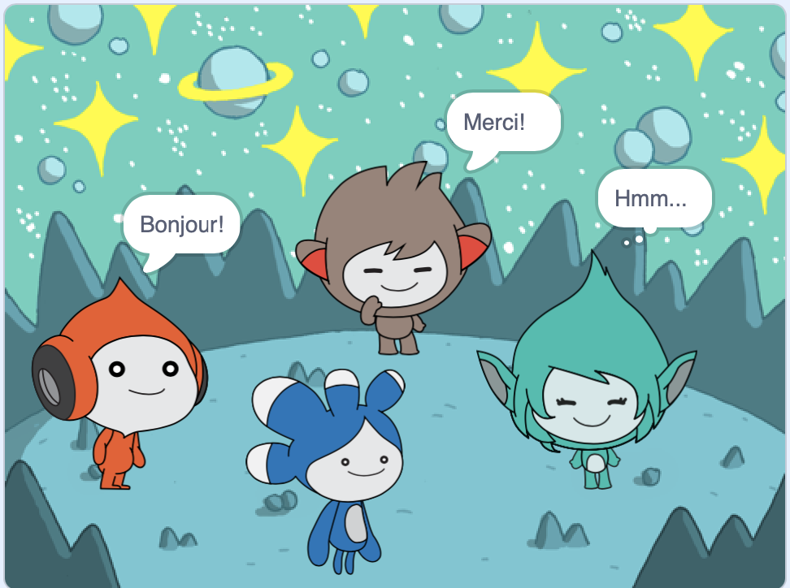

## Améliorer ton projet

<div style="display: flex; flex-wrap: wrap">
<div style="flex-basis: 200px; flex-grow: 1; margin-right: 15px;">
Ajoute le sprite **Tera** et utilise l'un des blocs que tu as appris pour créer une « émotion » pour le sprite **Tera**.
</div>
<div>

{:width="300px"}

</div>
</div>

Tu peux également utiliser l'extension Text to Speech pour faire parler **Tera** à voix haute  :

[[[scratch3-text-to-speech]]]

La personnalité du sprite **Tera** est ton choix, alors amuse-toi en utilisant tes propres idées créatives.

```blocks3
when this sprite clicked

say [Hello!] for [2] seconds

say [Hello!]

say [] // hide speech bubble

think [Hmm...] for [2] seconds

switch costume to [tera-d v]

wait (1) seconds // 0.5 is half a second

set [color v] effect to [0] // number up to 200

clear graphic effects

play sound [pop v] until done

start sound [pop v]

speak [hello]
```

Tu peux également « remixer » le projet pour apporter les modifications que tu souhaites. Tu peux changer l'arrière-plan et la façon dont les sprites s'émeuvent, et même choisir différents sprites et leur donner des émotions.

**Astuce :** Clique sur un sprite dans la liste des Sprite sous la scène pour modifier le code, les costumes et le son de ce sprite.

--- collapse ---
---
title : certificat de conversation dans l'espace
---

Bien joué ! Tu as terminé le projet conversation dans l'espace. Voici [un certificat](https://drive.google.com/file/d/18xx4uNIyRSty_2ujHkGDzGwTgfSGC1AF/view?usp=sharing){:target="_blank"} pour célébrer tes nouvelles compétences. Télécharge une copie puis ouvre-le pour ajouter ton nom.

--- /collapse ---

--- collapse ---
---
title: Le projet achevé
---

Tu peux voir le [projet terminé ici](https://scratch.mit.edu/projects/485673032/){:target="_blank"}.

--- /collapse ---

--- save ---
