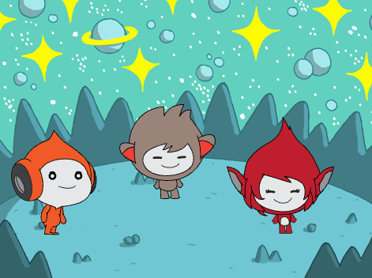

## אתה תעשה

צרו סצנת חלל עם דמויות 👾 ש"מביעות רגשות" כדי לשתף את מחשבותיהן או רגשותיהן.

בסקראץ׳, דמויות ואובייקטים נקראים **ספרייטים**, והם מופיעים בשלב **הבמה**.

אתה תעשה את הדברים הבאים:
+ הוסף ספרייטים ו **רקע** כדי להגדיר את הפרויקט שלך
+ לחצו על ספרייטים כדי לגרום להם לתקשר באמצעות בלוקי קוד `מראה`{:class="block3looks"} ו- `צליל`{:class="block3sound"}
+ השתמש ב **עורך צבע** כדי לשנות את **התחפושת**

--- no-print --- --- task ---
### נגן ▶️

  
לחצו על כל ספרייט כדי לראות מה הוא עושה. 

מה יקרה אם לוחצים על ספרייט אחד ואז לוחצים במהירות על הספרייט האחר?

  <iframe allowtransparency="true" width="485" height="402" src="https://scratch.mit.edu/projects/embed/485673032/?autostart=false" frameborder="0"></iframe>

--- /task --- --- /no-print ---

--- print-only ---

--- /print-only ---

