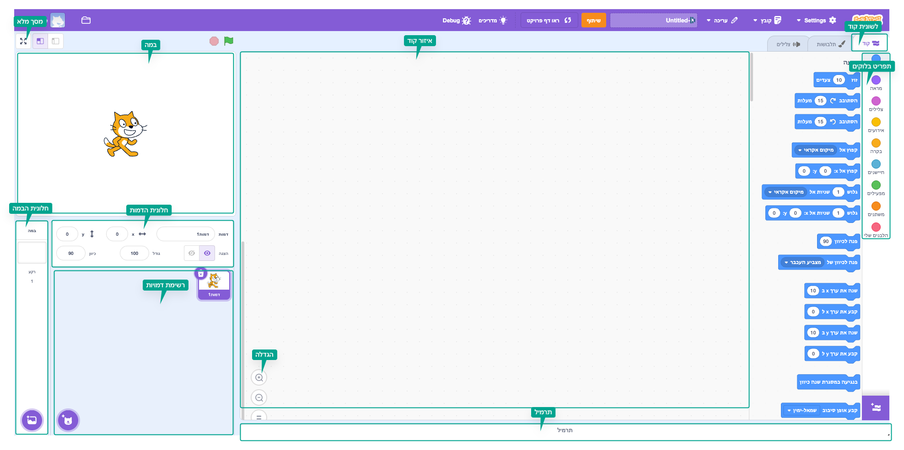
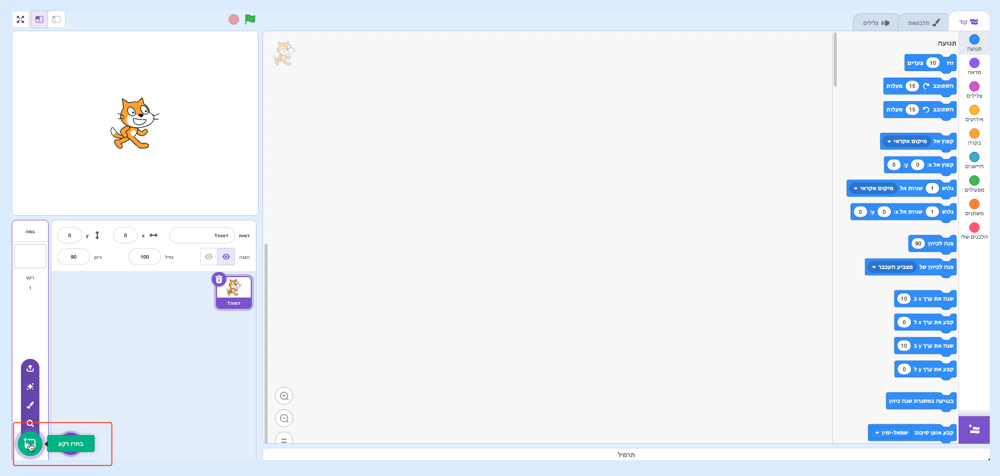
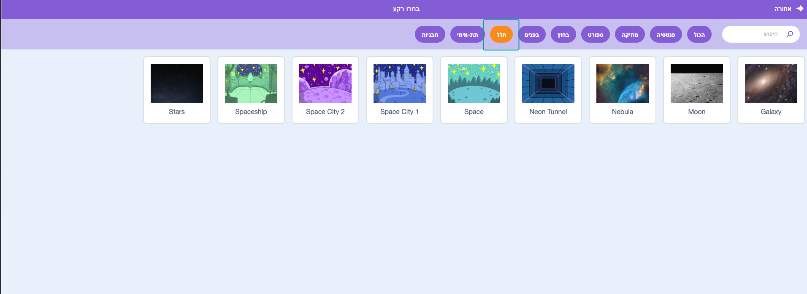
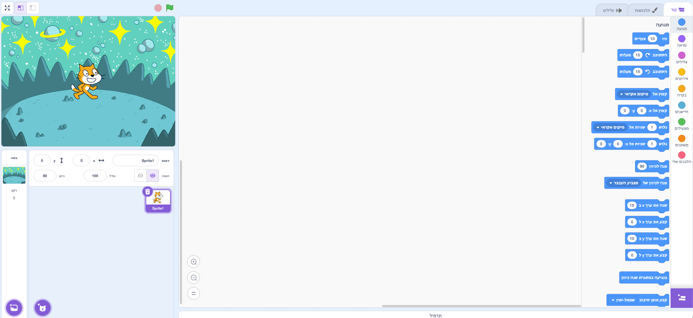
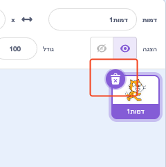
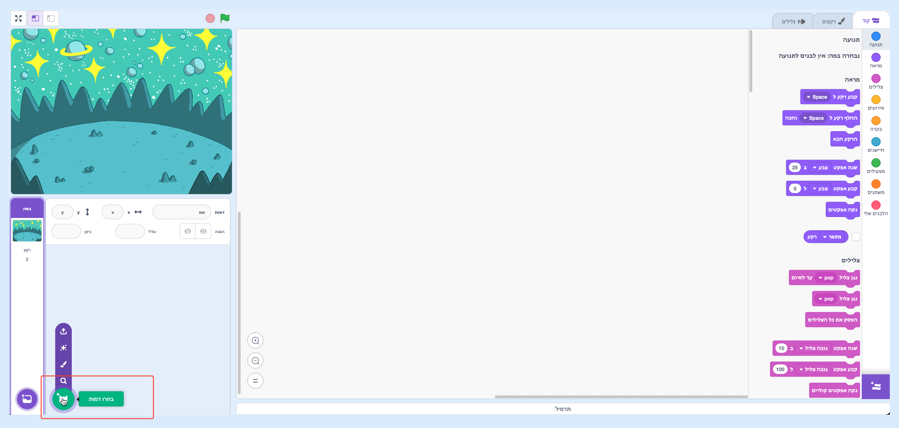
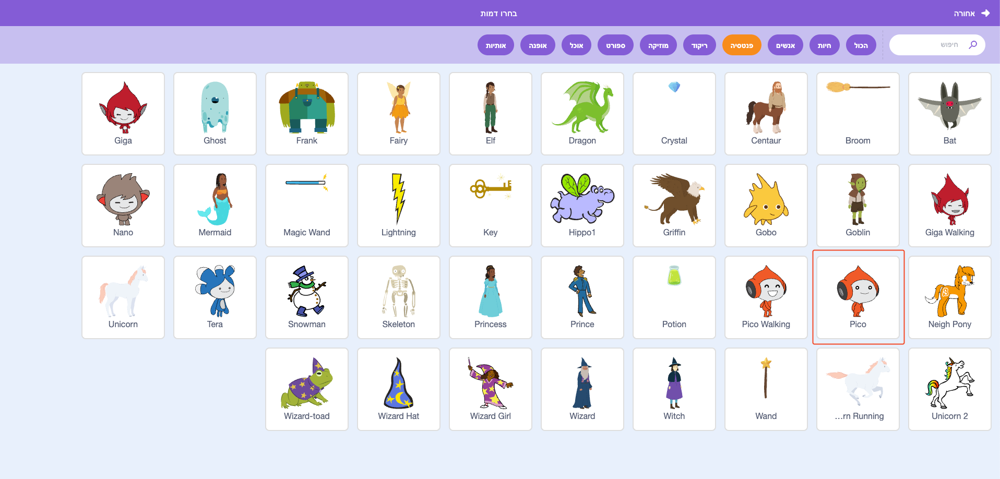
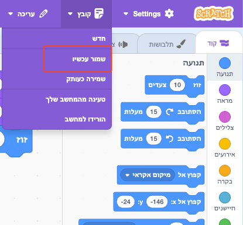

## צור את הסצנה שלך

הקימו את הפרויקט שלכם עם רקע של חלל והספרייט הראשון. 

{:width="300px"}

### פתח את פרויקט ההתחלתי

--- task ---

פתח את פרויקט ההתחלתי של [שיחת החלל](https://scratch.mit.edu/projects/582213331/editor){:target="_blank"}. סקראץ׳ ייפתח בכרטיסייה אחרת של הדפדפן.

[[[working-offline]]]

--- /task ---

### עורך סקראץ'

### הוסף רקע

**הבמה** הוא המקום שבו הפרויקט שלך פועל. **רקע** משנה את מראה הבמה.

--- task ---

לחצו (או בטאבלט, הקישו) על **בחרו רקע** בחלונית הבמה:

--- /task ---

--- task ---

לחצו על הקטגוריה **חלל** או הקלידו `חלל` בתיבת החיפוש:

--- /task ---

בדוגמה שלנו, בחרנו את הרקע **רווח**, אבל בחרו את הרקע שאתם הכי אוהבים.

--- task ---

לחץ על הרקע שבחרת כדי להוסיף אותו לפרויקט שלך. הבמה צריכה להציג את הרקע שבחרתם:

--- /task ---

### הוסף ספרייט

האם אתה יכול לראות את הספרייט שכבר כלול בפרויקט שלך? זהו חתול הסקראץ׳.

--- task ---

מחיקת הספרייט **ספרייט1** (חתול גירוד): בחרו את הספרייט **ספרייט1** ברשימת הספרייטים שמתחת לשלב ולחצו על סמל המחיקה.

--- /task ---

--- task ---

לחץ על **בחר ספרייט** ברשימת הספרייטים:

--- /task ---

--- task ---

בחר את הקטגוריה **פנטזיה**. לחץ על הספרייט **פיקו** כדי להוסיף אותו לפרויקט שלך.

--- /task ---

--- task ---

גררו את הספרייט **פיקו** כדי למקם אותו בצד שמאל של הבמה. הבמה שלך אמורה להיראות בערך כך:

--- /task ---

--- task ---

**שמירה**: אם אתם מחוברים לחשבון הסקראץ׳ שלכם, לחצו על כפתור הרמיקס הירוק. פעולה זו תשמור עותק של הפרויקט בחשבון סקראץ׳ שלך.

הקלד את שם הפרויקט שלך בתיבת שם הפרויקט בראש המסך.

**טיפ:** תנו לפרויקטים שלכם שמות נוחים כדי שתוכלו למצוא אותם בקלות כשיש לכם הרבה פרויקטים.

לאחר מכן, לחצו על **קובץ**, ולאחר מכן על **שמור עכשיו** כדי לשמור את הפרויקט.

אם אינך מחובר לאינטרנט או שאין לך חשבון סקראץ׳, תוכל ללחוץ על **שמור במחשב שלך** כדי לשמור עותק של הפרויקט שלך.

--- /task ---

