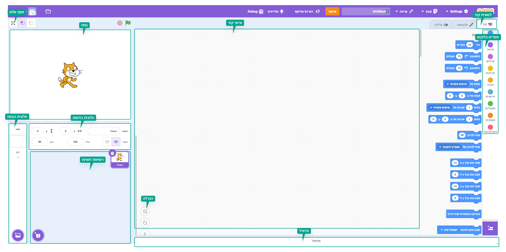
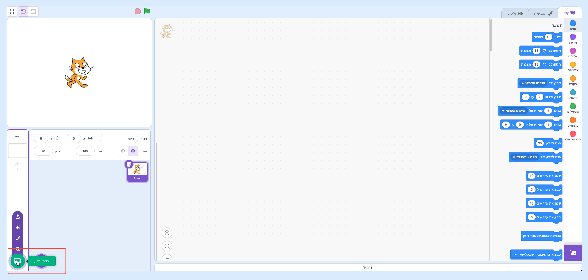
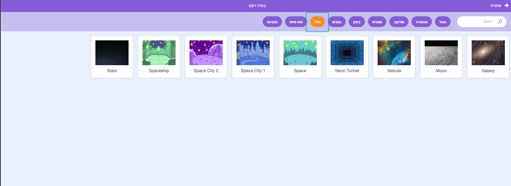
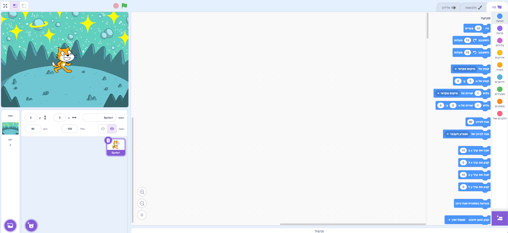
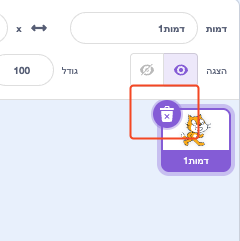
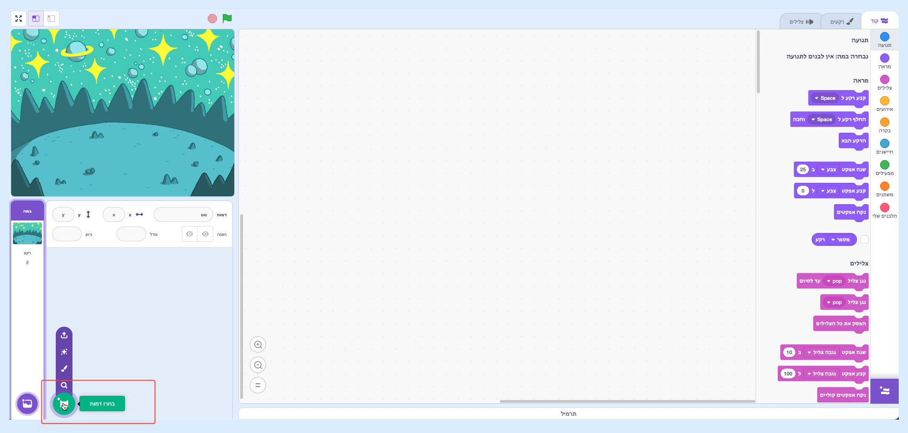
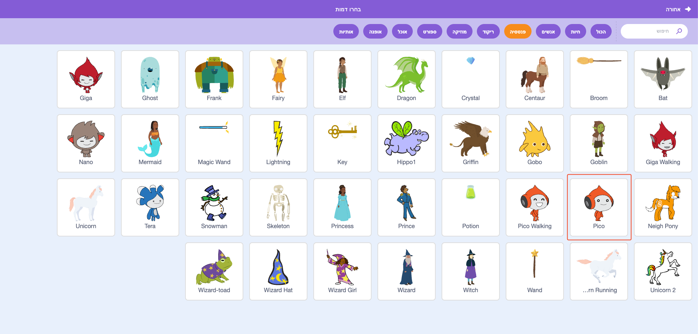
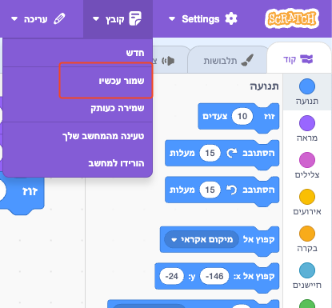

## צור את הסצנה שלך

הקימו את הפרויקט שלכם עם רקע של חלל והספרייט הראשון. 

{:width="300px"}

### פתח את פרויקט ההתחלתי

> [!TASK]
>
> פתח את פרויקט ההתחלתי של [שיחת החלל](https://scratch.mit.edu/projects/582213331/editor){:target="\_blank"}. סקראץ׳ ייפתח בכרטיסייה אחרת של הדפדפן.
>
> [[[working-offline]]]

### עורך סקראץ'

### הוסף רקע

**הבמה** הוא המקום שבו הפרויקט שלך פועל. **רקע** משנה את מראה הבמה.

> [!TASK]
>
> לחצו (או בטאבלט, הקישו) על **בחרו רקע** בחלונית הבמה:
>
> 
>
> 

> [!TASK]
>
> לחצו על הקטגוריה **חלל** או הקלידו `חלל` בתיבת החיפוש:
>
> 

בדוגמה שלנו, בחרנו את הרקע **רווח**, אבל בחרו את הרקע שאתם הכי אוהבים.

> [!TASK]
>
> לחץ על הרקע שבחרת כדי להוסיף אותו לפרויקט שלך. הבמה צריכה להציג את הרקע שבחרתם:
>
> 

### הוסף ספרייט

האם אתה יכול לראות את הספרייט שכבר כלול בפרויקט שלך? זהו חתול הסקראץ׳.

> [!TASK]
>
> מחיקת הספרייט **ספרייט1** (חתול גירוד): בחרו את הספרייט **ספרייט1** ברשימת הספרייטים שמתחת לשלב ולחצו על סמל המחיקה.
>
> 

> [!TASK]
>
> לחץ על **בחר ספרייט** ברשימת הספרייטים:
>
> 
>
> 

> [!TASK]
>
> בחר את הקטגוריה **פנטזיה**. לחץ על הספרייט **פיקו** כדי להוסיף אותו לפרויקט שלך.
>
> 

> [!TASK]
>
> גררו את הספרייט **פיקו** כדי למקם אותו בצד שמאל של הבמה. הבמה שלך אמורה להיראות בערך כך:
>
> 

> [!TASK]
>
> **שמירה**: אם אתם מחוברים לחשבון הסקראץ׳ שלכם, לחצו על כפתור הרמיקס הירוק. פעולה זו תשמור עותק של הפרויקט בחשבון סקראץ׳ שלך.
>
> 
>
> הקלד את שם הפרויקט שלך בתיבת שם הפרויקט בראש המסך.
>
> 
>
> **טיפ:** תנו לפרויקטים שלכם שמות נוחים כדי שתוכלו למצוא אותם בקלות כשיש לכם הרבה פרויקטים.
>
> לאחר מכן, לחצו על **קובץ**, ולאחר מכן על **שמור עכשיו** כדי לשמור את הפרויקט.
>
> 
>
> אם אינך מחובר לאינטרנט או שאין לך חשבון סקראץ׳, תוכל ללחוץ על **שמור במחשב שלך** כדי לשמור עותק של הפרויקט שלך.
