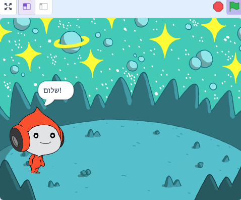

## פיקו אומר שלום

<div style="display: flex; flex-wrap: wrap">
<div style="flex-basis: 200px; flex-grow: 1; margin-right: 15px;">
לספרייט יכולים להיות קוד, תלבושות וצלילים כדי לשנות את המראה שלו ואת מה שהוא עושה. 
  
הוסף בלוקי קוד כדי ליצור אמוטיקון של פיקו עם מילים וצליל בעת לחיצה על הספרייט.
</div>
<div>

{:width="300px"}

</div>
</div>

<p style="border-left: solid; border-width:10px; border-color: #0faeb0; background-color: aliceblue; padding: 10px;">
<span style="color: #0faeb0">**אמוטים**</span> הם דרך להראות את האישיות של דמות במשחק. הם יכולים להשתמש בדיבור, צלילים, תנועה ואפקטים גרפיים, בדיוק כמו בסקראץ׳. האם אתם משחקים משחקים שמשתמשים באמוטים?
</p>

### השתמש בבלוק הדיבור

--- task ---

פתח את תפריט הבלוקים `מראה`{:class="block3looks"}.

לחץ על בלוק `אמור`{:class="block3looks"} `שלום!` `למשך`{:class="block3looks"} `2` `שניות`{:class="block3looks"}.


הספרייט **פיקו** יציג בועת דיבור למשך שתי שניות.



**טיפ:** בלוקי קוד בסקראץ׳ זוהרים עם קווי מתאר צהובים כשהם פועלים.

--- /task ---

--- task ---

גררו את הבלוק `אמור`{:class="block3looks"} `שלום!` `למשך`{:class="block3looks"} `2` `שניות`{:class="block3looks"} לאזור הקוד. לחץ עליו שוב.


--- /task ---

### לגרום לפיקו לדבר כשלוחצים עליו (או מקישים עליו)

--- task ---

גררו בלוק `כאשר הספרייט הזה נלחץ`{:class="block3events"} מתפריט הבלוקים `אירועים`{:class="block3events"} וחברו אותו לראש הבלוק `אמור`{:class="block3looks"} באזור הקוד. הבלוקים יתחברו יחד.


```blocks3
+when this sprite clicked
say [שלום!] for [2] seconds // הסתר דיבור לאחר 2 שניות
```

--- /task ---

### הערות הקוד

--- task ---

```blocks3
say [שלום!] for [2] seconds // הסתר דיבור לאחר 2 שניות
```
תראו הערות בדוגמאות הקוד. אינך צריך להוסיף את ההערות כשאתה מוסיף קוד לפרויקט שלך.

אם יש לכם זמן לאחר שתסיימו את הפרויקט, מומלץ להוסיף הערות לקוד שלכם כדי שיהיה קל יותר להבין אותו מאוחר יותר. נסה להוסיף הערה עכשיו. לחץ לחיצה ימנית (או בטאבלט, הקש והחזק) על בלוק באזור הקוד ובחר **הוסף הערה**.


--- /task ---

### מִבְחָן

--- task ---

**מבחן:** לחצו על הספרייט **פיקו** שעל הבמה ובדקו שבועת הדיבור מופיעה למשך שתי שניות. חשוב לבדוק את הקוד שלך כדי לוודא שהוא עושה את מה שאתה מצפה ממנו.

--- /task ---

--- task ---

כבר שמרת את הפרויקט שלך ונתת לו שם. סקראץ׳ ישמור **אוטומטי** עכשיו.

אתה עדיין יכול ללחוץ על שמור אם תרצה, רק כדי להיות בטוח.

--- /task ---
