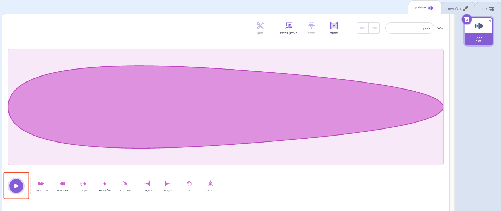
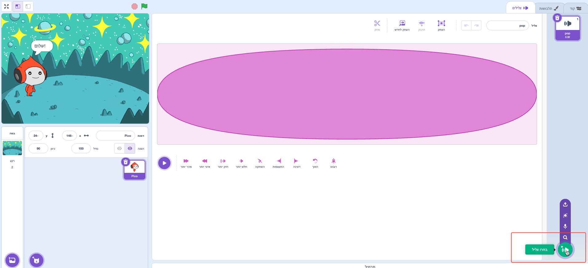
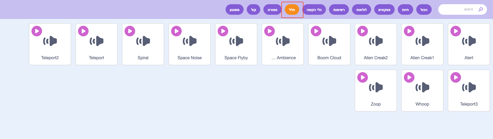
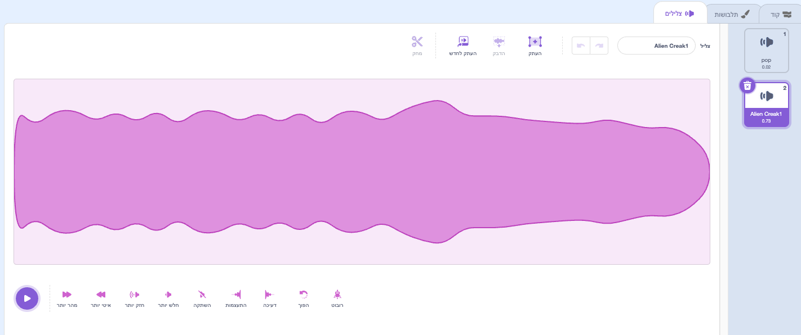
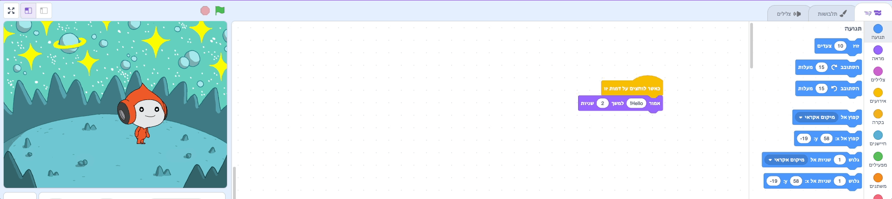
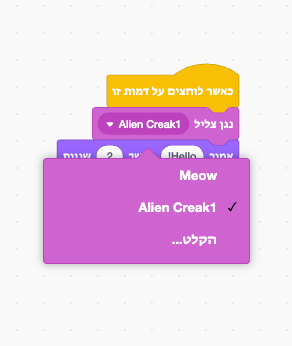

## פיקו משמיע צליל

<div style="display: flex; flex-wrap: wrap">
<div style="flex-basis: 200px; flex-grow: 1; margin-right: 15px;">
דרך נוספת לתקשר היא באמצעות צליל.
</div>
<div>

{:width="300px"}

</div>
</div>

### הוסף צליל לספרייט פיקו

--- task ---

לחצו על הכרטיסייה **צלילים** עבור הספרייט **פיקו** ותמצאו צליל **פופ**. לחץ על סמל **הפעל** כדי לשמוע את צליל **פופ**.



**בדיקה**: אם אינך שומע צליל, ודא שהצליל פועל במחשב או בטאבלט שלך.

--- /task ---

--- task ---

כדי לבחור צליל חדש, לחצו על הסמל **בחירת צליל** ובחרו את הקטגוריה **חלל** או הקלידו `חלל` בתיבת החיפוש.






--- /task ---

--- task ---

נגן כמה צלילים שונים באמצעות הסמל **הפעל**. לאחר שמצאתם את הצליל שברצונכם להשתמש בו, לחצו עליו כדי להוסיף אותו לפרויקט שלכם.



--- /task ---

### לגרום לצליל להתנגן בעת לחיצה (או הקשה)

--- task ---

לחץ על הכרטיסייה **קוד**. בתפריט הבלוקים `צליל`{:class="block3sound"}, מצא את הבלוק `נגן צליל`{:class="block3sound"}.

גררו את הבלוק לאזור הקוד, בין הבלוק `כאשר הספרייט הזה נלחץ`{:class="block3events"} לבין הבלוק `אמור`{:class="block3looks"}. ייפתח פער והבלוק ייכנס למקומו בנקישה.



הקוד שלך אמור להיראות כך:


```blocks3
when this sprite clicked
+start sound [Alien Creak1 v] 
say [שלום!] for [2] seconds // הסתר דיבור לאחר 2 שניות
```

--- /task ---

### בדוק את הקוד שלך

--- task ---

ודאו שבלוק `נגן צליל`{:class="block3sound"} שלכם מכיל את הצליל שבחרתם. אם לא, עליך ללחוץ על הצליל בבלוק `נגן צליל`{:class="block3sound"}, לאחר מכן לבחור את הצליל שבחרת מהתפריט הנפתח.



--- /task ---

--- task ---

**בדיקה:** לחצו על הספרייט **פיקו** ובדקו שבועת הדיבור מופיעה ושאתם יכולים לשמוע את הצליל. אם אינך שומע את הצליל, ודא שהוספת את הבלוק `נגן צליל`{:class="block3sound"} מתחת לבלוק `כאשר ספרייט זה לחץ`{:class="block3events"}.

--- /task ---

