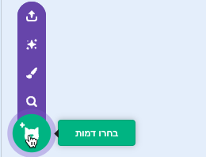
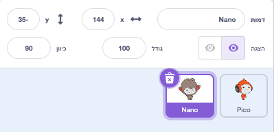
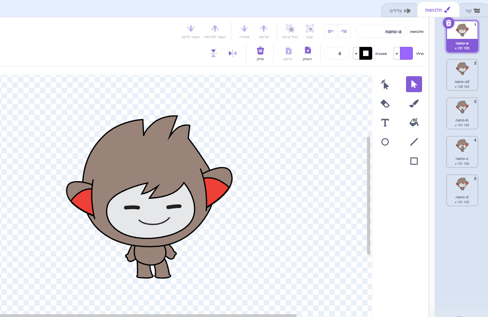
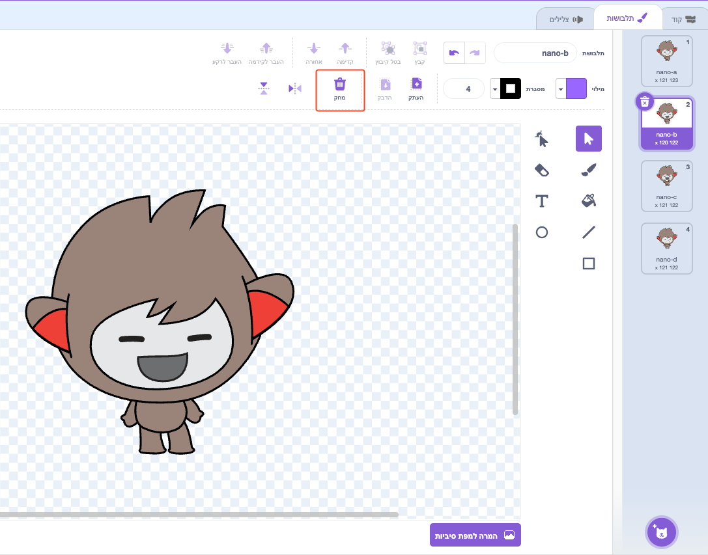
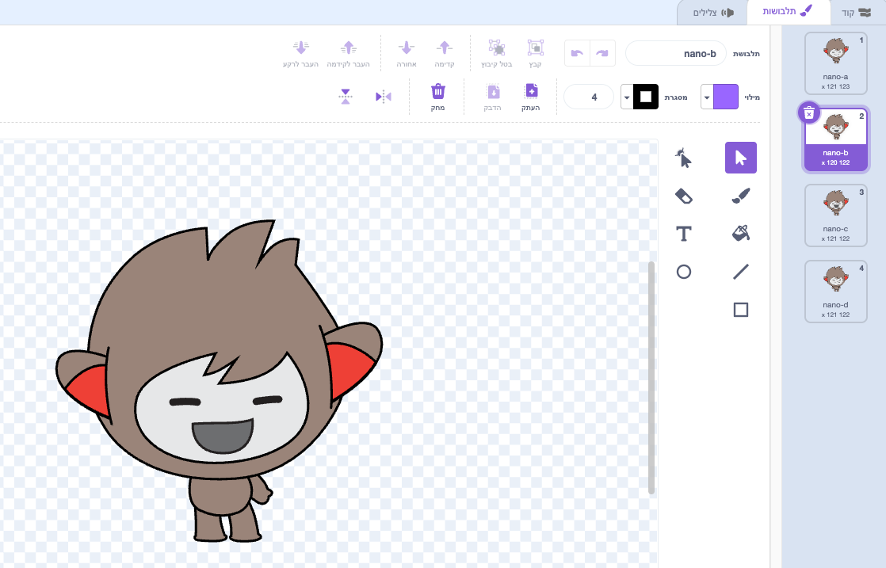
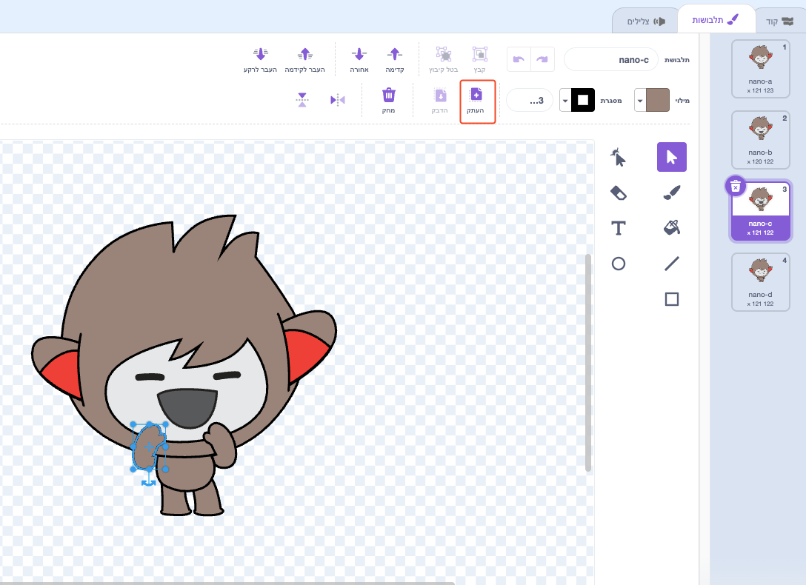
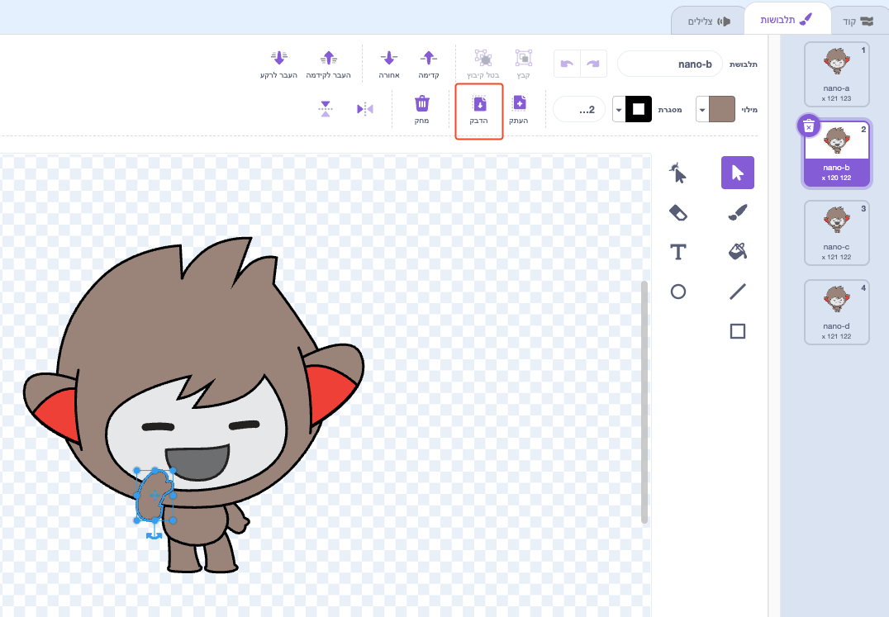

## ננו מחליף תחפושת

<div style="display: flex; flex-wrap: wrap">
<div style="flex-basis: 200px; flex-grow: 1; margin-right: 15px;">

גרמו לננו לעשות להביע רגש על ידי החלפת **תחפושות**.

לספרייטים יש **תחפושות** כדי לשנות את המראה שלהם. בדרך כלל מדובר בתמונות שונות במקצת של אותו ספרייט. כדי להנפיש ספרייט, ניתן לשנות את התלבושת שלו.

</div>
<div>

{:width="300px"}

</div>
</div>

### ננו מסמן "תודה!"

--- task ---

הוסף את הספרייט **ננו** לפרויקט שלך מהקטגוריה **פנטזיה**.



--- /task ---

--- task ---

ודא שהספרייט **ננו** נבחר ברשימת הספרייטים שמתחת לבמה.



לחצו על הכרטיסייה **קוד** והוסיפו סקריפט כדי לקבל את הספרייט **ננו** לסמן 'תודה' באמצעות `החליפו את התחפושת ל`{:class="block3looks"} ו- `המתינו`{:class="block3control"}. השתמשו בתפריט הנפתח כדי לעבור בין `ננו א׳`{:class="block3looks"} לבין `ננו ב׳`{:class="block3looks"}:


```blocks3
when this sprite clicked // when Nano is clicked
switch costume to [nano-b v] // Nano talking
wait (0.5) seconds // try 0.25 instead of 0.5
switch costume to [nano-a v] // Nano smiling
```
--- /task ---

**טיפ:** כל הבלוקים מקודדים בצבע, כך שתמצאו את הבלוק `החלפת תחפושת ל-`{:class="block3looks"} בתפריט הבלוקים `מראה`{:class="block3looks"} ואת הבלוק `המתנה`{:class="block3control"} בתפריט הבלוקים `שליטה`{:class="block3control"}.

--- task ---

**בדיקה:** לחצו על הספרייט **ננו** שעל הבמה ובדקו שהתלבושת של ננו משתנה.

--- /task ---

### ננו משתמש בשפת הסימנים

<p style="border-left: solid; border-width:10px; border-color: #0faeb0; background-color: aliceblue; padding: 10px;">מיליוני אנשים משתמשים בשפת הסימנים כדי לתקשר. דרך נפוצה לסמן "תודה" היא להניח את האצבעות על הסנטר כשהיד שטוחה ככל האפשר. לאחר מכן אתה מזיז את ידך קדימה, הרחק מהסנטר שלך וקצת למטה. 
</p>

<!-- Add a video of someone signing -->

ננו ישתמש בשפת הסימנים על ידי החלפת תלבושות.

אתם יכולים לערוך תלבושות עבור הספרייטים שלכם בעזרת עורך הצבע. אתה תערוך תחפושת של ננו כדי לגרום להם לסמן "תודה".

--- task ---

לחצו על הכרטיסייה **תלבושות** כדי לראות את התלבושות עבור הספרייט **ננו**:



--- /task ---

--- task ---

לחץ על התחפושת **ננו ב׳**. לחץ על הזרוע בצד שמאל, ולאחר מכן לחץ על **מחק**.



התחפושת צריכה להיראות כך:



--- /task ---

**טיפ:** אם עשיתם טעות בעורך הצבע, תוכלו ללחוץ על **בטל**.


--- task ---

עבור לתחפושת **ננו ג׳** ולחצו על הזרוע בצד שמאל, לאחר מכן לחצו על **העתק**.



--- /task ---

--- task ---

חזור לתחפושת **ננו ב׳** ולחץ על **הדבק**. התחפושת צריכה להיראות כך:



--- /task ---

--- task ---

**בדיקה:** לחצו על הספרייט **ננו** שעל הבמה ובדקו שהתלבושת של ננו משתנה לתלבושת שערכתם.

--- /task ---

<p style="border-left: solid; border-width:10px; border-color: #0faeb0; background-color: aliceblue; padding: 10px;">למדת איך לסמן "תודה". בפעם הבאה שתגיד תודה למישהו, למה שלא תשתמש במיומנות החדשה שלך?
</p>

