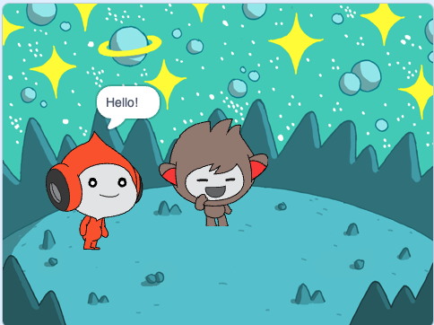

## ננו מחליף תחפושת

<div style="display: flex; flex-wrap: wrap">
<div style="flex-basis: 200px; flex-grow: 1; margin-right: 15px;">

גרמו לננו לעשות להביע רגש על ידי החלפת **תחפושות**.

לספרייטים יש **תחפושות** כדי לשנות את המראה שלהם. בדרך כלל מדובר בתמונות שונות במקצת של אותו ספרייט. כדי להנפיש ספרייט, ניתן לשנות את התלבושת שלו.

</div>
<div>

{:width="300px"}

</div>
</div>

--- task ---

הוסף את הספרייט **ננו** לפרויקט שלך מהקטגוריה **פנטזיה**.


--- /task ---

--- task ---

ודא שהספרייט **ננו** נבחר ברשימת הספרייטים שמתחת לבמה.


Click on the **Code** tab and add a script to get the **Nano** sprite to change costume using `switch costume to`{:class="block3looks"} and `wait`{:class="block3control"}. השתמשו בתפריט הנפתח כדי לעבור בין `ננו א׳`{:class="block3looks"} לבין `ננו ב׳`{:class="block3looks"}:


```blocks3
when this sprite clicked // כאשר לוחצים על ננו
switch costume to [nano-b v] // ננו מדבר
wait (0.5) seconds // נסה 0.25 במקום 0.5
switch costume to [nano-a v] // מחייך
```
--- /task ---

**טיפ:** כל הבלוקים מקודדים בצבע, כך שתמצאו את הבלוק `החלפת תחפושת ל-`{:class="block3looks"} בתפריט הבלוקים `מראה`{:class="block3looks"} ואת הבלוק `המתנה`{:class="block3control"} בתפריט הבלוקים `שליטה`{:class="block3control"}.

--- task ---

**בדיקה:** לחצו על הספרייט **ננו** שעל הבמה ובדקו שהתלבושת של ננו משתנה.

--- /task ---
