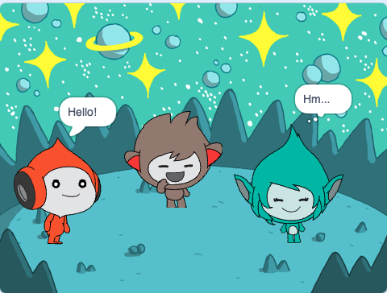

## גיגה משנה צבע

<div style="display: flex; flex-wrap: wrap">
<div style="flex-basis: 200px; flex-grow: 1; margin-right: 15px;">
ספרייטים יכולים גם להשתמש בבועות מחשבה ולשנות צבעים כדי להראות את אישיותם. אתה תגרום לגיגה לעשות את זה.
</div>
<div>

{:width="300px"}

</div>
</div>

### תגרום לגיגה לשנות צבע

--- task ---

הוסף את הספרייט **גיגה**.

גרור את הספרייט **גיגה** לצד ימין של הבמה.

--- /task ---

--- task ---

ודא שבחרת את הספרייט **גיגה** ברשימת הספרייטים שמתחת לבמה. הוסף את הקוד הזה כדי לגרום לספרייט **גיגה** לתקשר על ידי שינוי צבע:


```blocks3
when this sprite clicked
set [color v] effect to [0] // 0 is the starting colour
think [Hmm...] for [2] seconds 
clear graphic effects // back to the starting colour
```

--- /task ---

**טיפ:** לחצו על הספרייט ברשימת הספרייטים שמתחת לבמה לפני שאתם מוסיפים או משנים קוד, תלבושות או צלילים. ודא שלחצת על הספרייט הנכון.

--- task ---

נסה מספרים שונים מ- `1` עד `200` בבלוק `הגדר את אפקט הצבע ל-`{:class="block3looks"} עד שתמצא צבע שאתה אוהב.

--- /task ---

--- task ---

שנה את המילים ומספר השניות בבלוק `חושב`{:class="block3looks"}.

--- /task ---

--- task ---

**בדיקה:** לחצו על הספרייט **גיגה** על הבמה ובדקו שהספרייט משנה צבע ומציג בועת מחשבה.

--- /task ---

