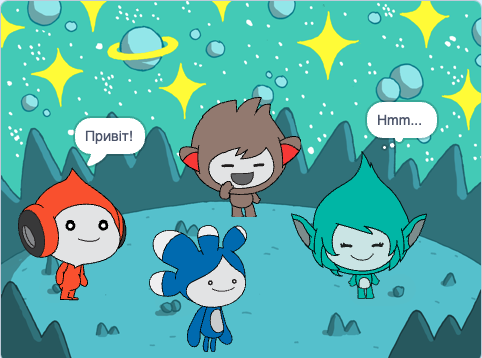

## שדרגו את הפרויקט שלכם

<div style="display: flex; flex-wrap: wrap">
<div style="flex-basis: 200px; flex-grow: 1; margin-right: 15px;">
הוסיפו את הספרייט **טרה** והשתמשו בכל אחד מהבלוקים שלמדתם עליהם כדי ליצור 'רגש' עבור הספרייט **טרה**.
</div>
<div>

{:width="300px"}

</div>
</div>

ניתן גם להשתמש בהרחבת טקסט לדיבור כדי לגרום ל- **טרה** לדבר בקול רם:

[[[scratch3-text-to-speech]]]

האישיות של הספרייט **טרה** היא בחירתכם, אז תהנו להשתמש ברעיונות יצירתיים משלכם.

```blocks3
when this sprite clicked

say [Hello!] for [2] seconds

say [Hello!]

say [] // hide speech bubble

think [Hmm...] for [2] seconds

switch costume to [tera-d v]

wait (1) seconds // 0.5 is half a second

set [color v] effect to [0] // number up to 200

clear graphic effects

play sound [pop v] until done

start sound [pop v]

speak [hello]
```

ניתן גם 'לערוך מחדש' את הפרויקט כדי לבצע שינויים שתרצו. אפשר לשנות את הרקע, ואת האופן שבו הספרייטים מרגישים, ואפילו לבחור ספרייטים שונים ולתת להם רגשות.

**טיפ:** לחצו על ספרייט ברשימת הספרייטים שמתחת לבמה כדי לשנות את הקוד, התלבושות והצליל עבור אותו ספרייט.

--- collapse ---
---
כותרת: פרויקט שהושלם
---

ניתן לצפות בפרויקט שהושלם [כאן](https://scratch.mit.edu/projects/485673032/){:target="_blank"}.

--- /collapse ---

--- save ---
