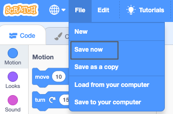

## अपना दृश्य बनाएं

इस चरण में, आप अपने प्रोजेक्ट को एक अंतरिक्ष बैकड्रॉप और पहले स्प्राइट के साथ सेट करेंगे। 

{:width="300px"}

--- task ---

Open the [Space talk starter project](https://scratch.mit.edu/projects/582213331/editor){:target="_blank"}. Scratch दूसरे ब्राउज़र टैब में खुलेगा।

[[[working-offline]]]

--- /task ---

Scratch एडिटर इस प्रकार दिखाई देता है:

**Stage** वह जगह है जहाँ आपका प्रोजेक्ट चलता है। A **backdrop** changes the way that the Stage looks.

--- task ---

स्टेज पेन में **Choose a backdrop** पर क्लिक करें (या टैबलेट पर, टैप करें):

--- /task ---

--- task ---

**Space** कैटेगरी पर क्लिक करें या सर्च बॉक्स में `space` लिखें:

--- /task ---

हमारे उदाहरण में, हमने **space** बैकड्रॉप को चुना है, लेकिन आप वह बैकड्रॉप चुनें जो आपको सबसे अधिक पसंद हो।

--- task ---

इसे अपने प्रोजेक्ट में इस्तेमाल करने के लिए अपने चुने हुए बैकड्रॉप पर क्लिक करें। स्टेज को आपके द्वारा चुना गया बैकड्रॉप दिखाना चाहिए:

--- /task ---

क्या आप उस sprite को देख सकते हैं जो पहले से ही आपके प्रोजेक्ट में शामिल है? वह Scratch कैट (cat) है।

--- task ---

**Sprite1** (स्क्रैच कैट) sprite हटाएँ: **Sprite1** sprite को स्टेज के नीचे sprite लिस्ट में से चुने और **Delete** आइकन पर क्लिक करें ।

--- /task ---

--- task ---

Sprite लिस्ट में **Choose a Sprite** पर क्लिक करें:

--- /task ---

--- task ---

**Fantasy** श्रेणी को चुनें। अपने प्रोजेक्ट में इस्तेमाल करने के लिए **Pico** sprite पर क्लिक करें।

--- /task ---

--- task ---

स्टेज के बाईं ओर स्थित करने के लिए **Pico** spriteको उसी ओर खींचे। आपका स्टेज कुछ इस तरह दिखाई देना चाहिए:

--- /task ---

--- task ---

यदि आप अपने Scratch खाते में साइन किया हुआ है, तो हरे रंग के Remix button पर क्लिक करें। इससे प्रोजेक्ट की एक कॉपी आपके Scratch खाते में सेव हो जाएगी।

स्क्रीन के शीर्ष पर प्रोजेक्ट नाम बॉक्स में अपने प्रोजेक्ट का नाम टाइप करें।

**Tip:** अपने प्रोजेक्टस को आसान नाम दें ताकि जब आपके पास बहुत सारे प्रोजेक्टस हो, तो आप उन्हें आसानी से ढूंढ सकें।

इसके बाद अपने प्रोजेक्ट को सेव करने के लिए **File** पर क्लिक करें और फिर **Save** पर क्लिक करें।

यदि आप ऑनलाइन नहीं हैं या आपके पास Scratch अकाउंट नहीं है, तो आप अपने प्रोजेक्ट की एक कॉपी को सेव करने के लिए **Save to your computer** पर क्लिक करें।

--- /task ---

