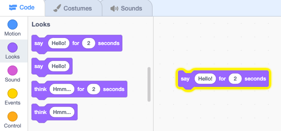
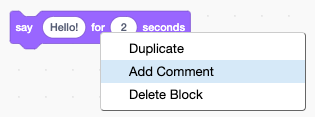

## Pico बोले हेलो

<div style="display: flex; flex-wrap: wrap">
<div style="flex-basis: 200px; flex-grow: 1; margin-right: 15px;">
एक स्प्राइट में कोड, कोस्टयूम और ध्वनियां हो सकती हैं जिससे की हम वह कैसा दिखता है या क्या करता है, वह बदल सकते हैं। 
  
जब आप स्प्राइट पर क्लिक करते हैं, तो शब्दों और ध्वनि के साथ पिको को भावपूर्ण बनाने के लिए आप कोड ब्लॉक जोड़ेंगे।
</div>
<div>

{:width="300px"}

</div>
</div>

ब्लॉक का उपयोग करने के लिए, आप ब्लॉक मेनू में उन पर क्लिक कर सकते हैं।

--- task ---

`Looks`{:class="block3looks"} ब्लॉक मेन्यू खोलें।

`say`{:class="block3looks"} `Hello!` `for`{:class="block3looks"} `2` `seconds`{:class="block3looks"} ब्लॉक पर क्लिक करें।


**Pico** स्प्राइट दो सेकंड के लिए स्पीच बबल दिखाएगा।


**Tip:** कोड जब चल रहा होता है तो Scratch पीले रंग की आउटलाइन के साथ चमकते हैं।

--- /task ---

आप ब्लॉक को कोड क्षेत्र में खींच सकते हैं, और उनका उपयोग वहां से किया जा सकता है।

--- task ---

`say`{:class="block3looks"} `Hello!` `for`{:class="block3looks"} `2` `सेकंड`{:class="block3looks"} ब्लॉक को कोड क्षेत्र में खींचे। उस पर फिर से क्लिक करें।




--- /task ---

एक समय में एक से अधिक ब्लॉक चलाने के लिए कोड क्षेत्र में ब्लॉक को एक साथ जोड़ा जा सकता है। जुड़े हुए ब्लॉक ऊपर से नीचे के क्रम में चलेंगे।

--- task ---

`Events`{:class="block3events"} ब्लॉक मेनू से `when this sprite clicked`{:class="block3events"} ब्लॉक को खींचे और उसे अपने कोड क्षेत्र में `say`{:class="block3looks"} ब्लॉक के ऊपर जोड़ दें। ब्लॉक एक साथ चिपक जाएंगे।


```blocks3
+when this sprite clicked
say [Hello!] for [2] seconds // hide speech after 2 seconds
```

--- /task ---

एक कमेंट विस्तार से बताता है कि आपका कोड क्या करता है।

```blocks3
say [Hello!] for [2] seconds // hide speech after 2 seconds
```
आप कोड उदाहरणों में कमेंट देखेंगे। जब आप अपने प्रोजेक्ट में कोड जोड़ते हैं तो आपको कमेंट को डालने की आवश्यकता नहीं होती है।

यदि आपके पास अपना प्रोजेक्ट पूरा करने करने के बाद समय बचता हैं, तो अपने कोड में कमेंट डालना एक अच्छा विचार है ताकि बाद में इसे समझना आसान हो। एक कमेंट डालने के लिए, कोड क्षेत्र में एक ब्लॉक पर राइट-क्लिक करें (या टैबलेट पर, टैप और होल्ड करें) और **Add comment** चुनें।



--- task ---

**Test:** स्टेज पर स्प्राइट पर **Pico** क्लिक करें और जांचें कि स्पीच बबल दो सेकंड के लिए दिखाई देता है। अपने कोड का टेस्ट करना ज़रूरी हैं ताकि आप ये देख सकें की क्या ये वही कर रहा है जैसा आप चाहते हैं।

--- /task ---

--- save ---
