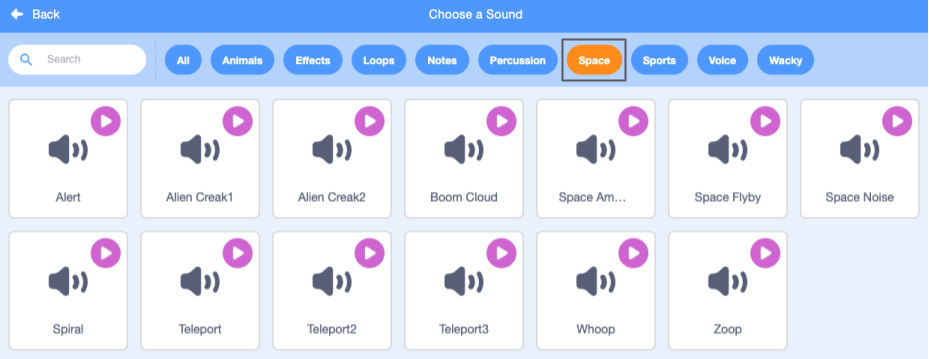

## Pico ने बजायी एक ध्वनि

<div style="display: flex; flex-wrap: wrap">
<div style="flex-basis: 200px; flex-grow: 1; margin-right: 15px;">
बातचीत करने का दूसरा तरीका ध्वनि का उपयोग करना है।
</div>
<div>

{:width="300px"}

</div>
</div>

### पिको स्प्राइट में ध्वनि जोड़ें

--- task ---

**Pico** स्प्राइट के लिए **Sounds** टैब पर क्लिक करें और वहां आपको **pop** ध्वनि मिलेगी। **Pop** ध्वनि सुनने के लिए **Play** आइकन पर क्लिक करें।


**डीबग**: यदि आप कोई ध्वनि नहीं सुन सकते हैं तो जांचें कि ध्वनि आपके कंप्यूटर या टैबलेट पर काम कर रही है।

--- /task ---

--- task ---

एक नई ध्वनि चुनने के लिए, **ध्वनि चुनें** आइकन पर क्लिक करें और **अंतरिक्ष** श्रेणी चुनें या खोज बॉक्स में `अंतरिक्ष` टाइप करें।




--- /task ---

--- task ---

**प्ले** आइकन का उपयोग करके कुछ भिन्न ध्वनियां बजाएं। एक बार जब आपको वह ध्वनि मिल जाए जिसका आप उपयोग करना चाहते हैं, तो उसे अपने प्रोजेक्ट में जोड़ने के लिए उस पर क्लिक करें।


--- /task ---

### क्लिक करने पर (या टैप किए जाने पर) ध्वनि बजाएं

--- task ---

**कोड** टैब पर क्लिक करें। `ध्वनि`{:class="block3sound"} ब्लॉक मेनू में, `प्रारंभ ध्वनि`{:class="block3sound"} ब्लॉक ढूंढें।

`जब यह स्प्राइट क्लिक किया गया`{:class="block3events"} ब्लॉक और `कहना`{:class="block3looks"} ब्लॉक के बीच, ब्लॉक को कोड क्षेत्र में खींचें। एक गैप खुल जाएगा और ब्लॉक अपनी जगह पर आ जाएगा।


आपका कोड इस प्रकार दिखना चाहिए:


```blocks3
when this sprite clicked
+start sound [Alien Creak1 v] 
say [Hello!] for [2] seconds // hide speech after 2 seconds
```

--- /task ---

### अपने कोड का परीक्षण करें

--- task ---

जांचें कि आपके `प्रारंभ ध्वनि`{:class="block3sound"} ब्लॉक में आपकी चुनी हुई ध्वनि है। यदि ऐसा नहीं होता है, तो आपको `प्रारंभ ध्वनि`{:class="block3sound"} ब्लॉक में ध्वनि पर क्लिक करना होगा, फिर ड्रॉप-डाउन मेनू में अपनी चुनी हुई ध्वनि का चयन करें।


--- /task ---

--- task ---

**परीक्षण:** **पिको** स्प्राइट पर क्लिक करें और जांचें कि स्पीच बबल प्रकट होता है और आप ध्वनि सुन सकते हैं। यदि आप ध्वनि नहीं सुनते हैं, तो सुनिश्चित करें कि आपने `जब यह स्प्राइट क्लिक किया`{:class="block3events"} ब्लॉक के तहत `स्टार्ट साउंड`{:class="block3sound"} ब्लॉक जोड़ा है।

--- /task ---

