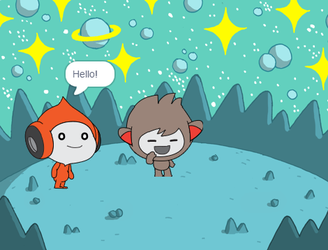

## नैनो ने बदला कोस्टयूम

<div style="display: flex; flex-wrap: wrap">
<div style="flex-basis: 200px; flex-grow: 1; margin-right: 15px;">

**वेशभूषा** बदलकर नैनो को भावपूर्ण बनाएं।

स्प्राइट्स के पास **कॉस्टयूम** होते हैं जो उनके दिखने के तरीके को बदल देते हैं। They are usually slightly different images of the same sprite. एक स्प्राइट को चेतन करने के लिए, आप उसकी पोशाक बदल सकते हैं।

</div>
<div>

{:width="300px"}

</div>
</div>

--- task ---

**Fantasy** श्रेणी से अपने प्रोजेक्ट में **Nano** स्प्राइट को डालें।


--- /task ---

--- task ---

सुनिश्चित करें कि Stage के नीचे Sprite सूची में **Nano** का चयन किया गया है।


Click on the **Code** tab and add a script to get the **Nano** sprite to change costume using `switch costume to`{:class="block3looks"} and `wait`{:class="block3control"}. Use the drop down menu to switch between `nano-b`{:class="block3looks"} and `nano-a`{:class="block3looks"}:


```blocks3
when this sprite clicked // जब Nano पर क्लिक किया जाता है
switch costume to [nano-b v] // Nano बात कर रहा है
wait (0.5) seconds //  के बजाय 1 प्रयास करें
switch costume to [nano-a v] // Nano मुस्कुराते हुए
```
--- /task ---

**युक्ति:** सभी ब्लॉक रंग-कोडित हैं, इसलिए आप `स्विच कॉस्ट्यूम को`{:class="block3looks"} ब्लॉक में `लुक्स`{:class="block3looks"} ब्लॉक मेनू और `प्रतीक्षा में पाएंगे`{:class="block3control"} `Control`{:class="block3control"} ब्लॉक मेन्यू में ब्लॉक करें।

--- task ---

**परीक्षण:** स्टेज पर **नैनो** स्प्राइट पर क्लिक करें और जांचें कि नैनो की पोशाक बदल रही है या नहीं।

--- /task ---
