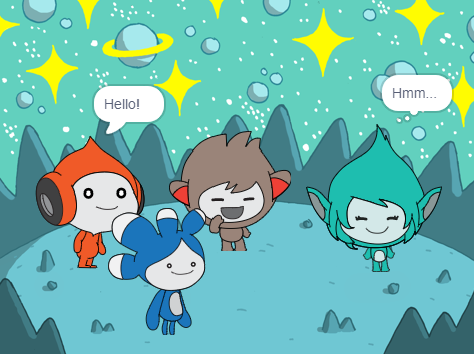

## प्रोजेक्ट को अपग्रेड करें

<div style="display: flex; flex-wrap: wrap">
<div style="flex-basis: 200px; flex-grow: 1; margin-right: 15px;">
**Tera** स्प्राइट जोड़ें और आपके द्वारा सीखे गए किसी भी ब्लॉक का उपयोग **Tera** स्प्राइट के लिए 'इमोट' बनाने के लिए करें।
</div>
<div>

{:width="300px"}

</div>
</div>

**Tera** स्प्राइट का व्यक्तित्व आपकी पसंद है, इसलिए अपने स्वयं के रचनात्मक विचारों का उपयोग करके मज़े करें।

```blocks3
when this sprite clicked

say [Hello!] for [2] seconds

say [Hello!]

say [] // स्पीच बबल छुपाएं

think [Hmm...] for [2] seconds

switch costume to [tera-d v]

set [color v] effect to [0] // 200 तक की संख्या

clear graphic effects

play sound [pop v] until done

start sound [pop v]
```

आप अपनी पसंद का कोई भी बदलाव करने के लिए प्रोजेक्ट को 'Remix' भी कर सकते हैं। आप बॅकड्रोप बदल सकते हैं, और स्प्राइट्स कैसे इमोट करते हैं इसमे परिवर्तन कर सकते हैं, और यहां तक कि अलग-अलग स्प्राइट्स भी चुन सकते हैं और उन्हें इमोट दे सकते हैं।

**सलाह:** कोड, कास्ट्यूम या ध्वनि जोड़ने या बदलने से पहले स्टेज के नीचे Spite लिस्ट में स्प्राइट पर क्लिक करें।

--- collapse ---
---
title: स्पेस टॉक सर्टिफिकेट
---

बहुत बढ़िया! आपने स्पेस टॉक प्रोजेक्ट पूरा कर लिया है। यहाँ [एक सर्टिफिकेट](https://drive.google.com/file/d/18xx4uNIyRSty_2ujHkGDzGwTgfSGC1AF/view?usp=sharing){:target="_blank"} है आपके नए कौशल का जश्न मनाने के लिए एक प्रति डाउनलोड करें और फिर अपना नाम जोड़ने के लिए इसे खोलें।

--- /collapse ---

--- collapse ---
---
title: पूरा किया हुआ प्रोजेक्ट।
---

आप पूर्ण प्रोजेक्ट यहां से प्राप्त कर सकते हैं [पूरा किया हुआ प्रोजेक्ट यहाँ है](https://scratch.mit.edu/projects/658227120/){:target="_blank"}

--- /collapse ---

--- save ---
