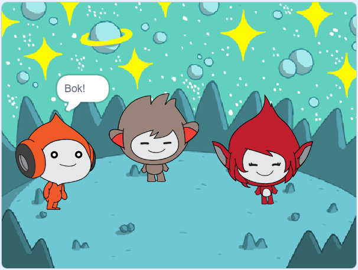

## What you will make

Stvorite svemirsku scenu s likovima 👾 koji 'emotivno' dijele svoje misli ili osjećaje.

U Scratchu se likovi i objekti nazivaju **likovi**, a pojavljuju se na **pozornici**.

Vi ćete:
+ Dodajte likove i **pozadinu** kako bi postavili svoj projekt
+ Kliknite na likove kako biste ih natjerali da komuniciraju koristeći `izgled`{:class="block3looks"} i `zvuk`{:class="block3sound"} blokove koda
+ Koristite **Uređivač kostima** za promjenu **kostima**

--- no-print --- --- task ---
### Igraj ▶️

  
Kliknite na svaki lik da vidite što rade. 

Što se događa ako kliknete na jedan lik, a zatim brzo kliknete na drugi lik?

  <iframe allowtransparency="true" width="485" height="402" src="https://scratch.mit.edu/projects/embed/485673032/?autostart=false" frameborder="0"></iframe>

--- /task --- --- /no-print ---

--- print-only ---

--- /print-only ---

