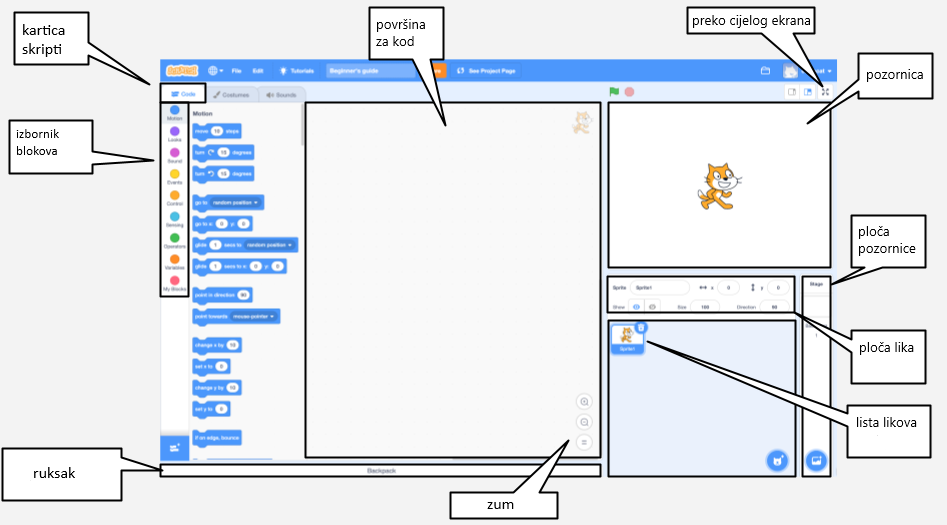
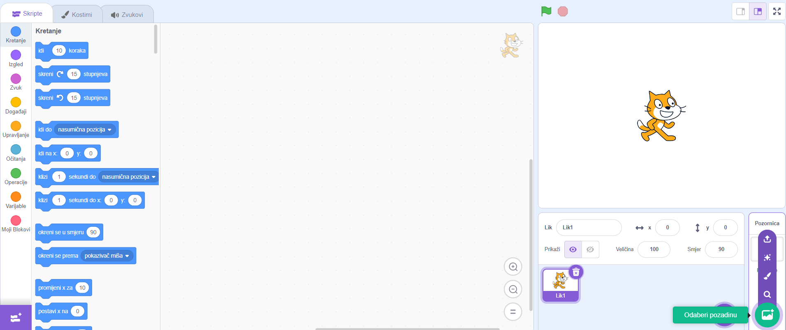
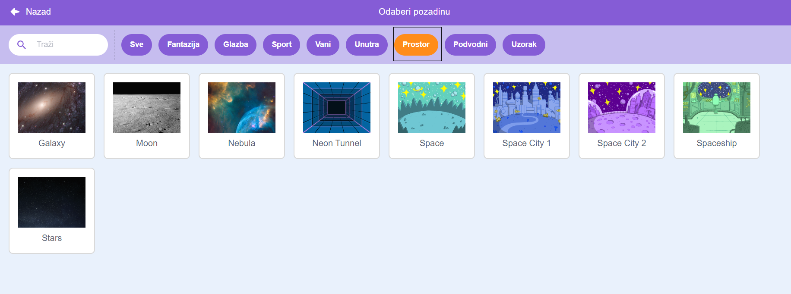
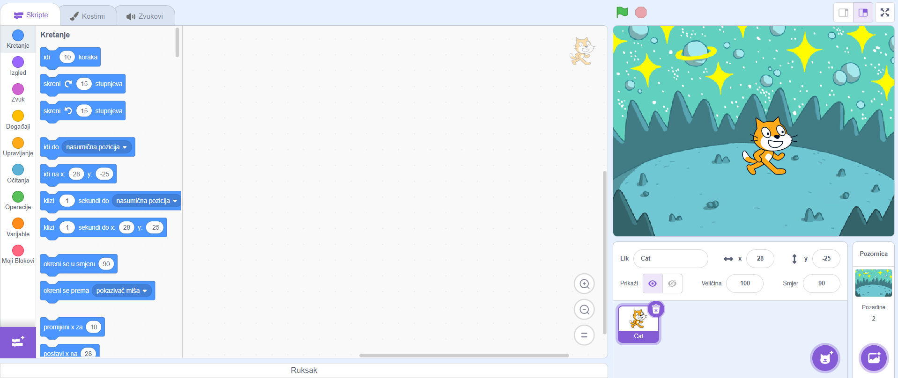
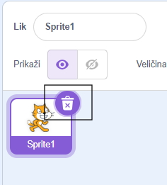
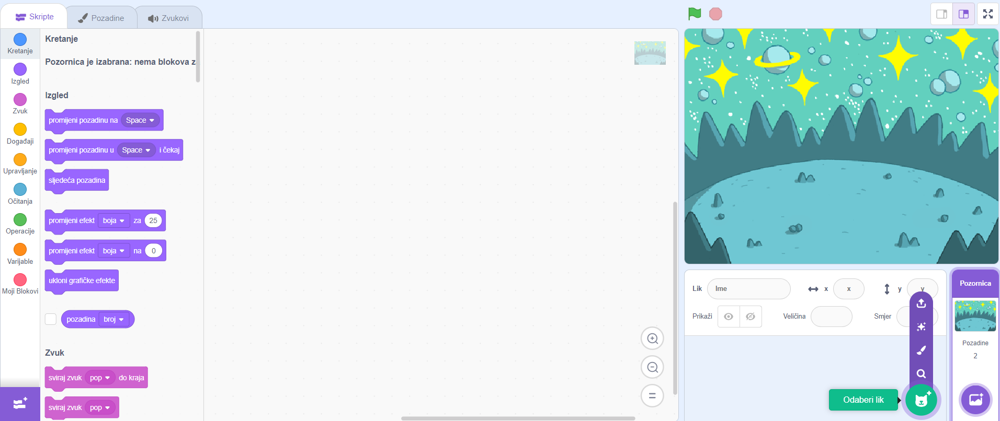
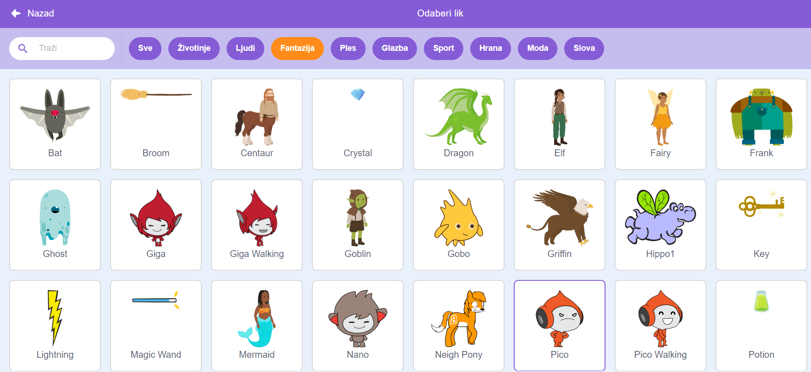
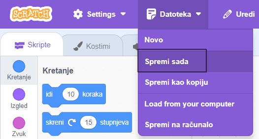

## Kreirajte svoju scenu

Postavite svoj projekt sa svemirskom pozadinom i prvim likom. 

{:width="300px"}

### Otvori početni projekt

--- task ---

Otvorite [početni projekt Razgovor o svemiru](https://scratch.mit.edu/projects/582213331/editor){:target="_blank"}. Scratch će se otvoriti u drugoj kartici preglednika.

[[[working-offline]]]

--- /task ---

### Scratch uređivač

### Dodavanje pozadine

**Pozornica** je mjesto gdje se vaš projekt izvodi. **Pozadina** mijenja način na koji pozornica izgleda.

--- task ---

Kliknite (ili na tabletu dodirnite) na **Odaberite pozadinu** u ploči Pozornica:

--- /task ---

--- task ---

Kliknite na kategoriju **Prostor** ili upišite `prostor` u okvir za pretraživanje:

--- /task ---

U našem primjeru odabrali smo pozadinu **Svemir**, ali odaberite pozadinu koja vam se najviše sviđa.

--- task ---

Klikni na pozadinu da ju dodaš u svoj projekt. Pozornica bi trebala prikazivati pozadinu koju ste odabrali:

--- /task ---

### Dodaj lika

Možete li vidjeti lika koji je već uključen u vaš projekt? To je Scratch mačka.

--- task ---

Izbrišite **Lika 1** (Scratch mačka): odaberite **Lik 1** lika na popisu Likova ispod pozornice i kliknite na **Izbriši** ikona.

--- /task ---

--- task ---

Kliknite na **Odaberite lika** na popisu Likova:

--- /task ---

--- task ---

Odaberite kategoriju **Fantazija**. Kliknite na **Pico** lik da biste ih dodali u svoj projekt.

--- /task ---

--- task ---

Povucite **Pico** lik da biste ih postavili na lijevu stranu pozornice. Vaša bi pozornica trebala izgledati otprilike ovako:

--- /task ---

--- task ---

**Spremi**: Ako ste prijavljeni na svoj Scratch račun, kliknite na zeleni gumb Obrada. Ovo će spremiti kopiju projekta na vaš Scratch račun.

Upišite naziv svog projekta u okvir za naziv projekta na vrhu ekrana.

**Savjet:** Dajte svojim projektima korisna imena tako da ih možete lako pronaći kada imate puno projekata.

Zatim klikni na **Datoteka** pa **Spremi sada** da spremiš svoj projekt.

Ako niste na mreži ili nemate Scratch račun, možete kliknuti na **Spremi na svoje računalo** da biste spremili kopiju svog projekta.

--- /task ---

