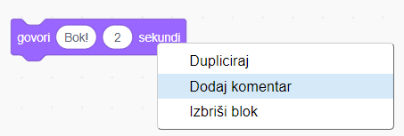

## Pico kaže bok

<div style="display: flex; flex-wrap: wrap">
<div style="flex-basis: 200px; flex-grow: 1; margin-right: 15px;">
Lik može imati kod, kostime i zvukove koji mijenjaju način na koji izgleda i što radi. 
  
Dodajte blokove koda kako bi Pico izrazio emocije riječima i zvukom kada se klikne na lika.
</div>
<div>

{:width="300px"}

</div>
</div>

<p style="border-left: solid; border-width:10px; border-color: #0faeb0; background-color: aliceblue; padding: 10px;">
<span style="color: #0faeb0">**Emoti**</span> su način prikazivanja osobnosti lika u igri. Mogu koristiti govor, zvukove, pokrete i grafičke efekte, baš kao u Scratchu. Igrate li igrice koje koriste emocije?
</p>

### Koristite blok govori

--- task ---

Otvorite izbornik blokova `Izgled`{:class="block3looks"}.

Kliknite na `govori`{:class="block3looks"} `Bok!` `za`{:class="block3looks"} `2` `sekundi`{:class= "block3looks"} blok.


**Pico** lik će prikazati oblačić govora na dvije sekunde.


**Savjet:** Blokovi koda u Scratchu svijetle žutim obrisom dok se izvode.

--- /task ---

--- task ---

Povucite `govori`{:class="block3looks"} `Bok!` `za`{:class="block3looks"} `2` `sekundi`{:class= "block3looks"} blok do područja koda. Ponovno kliknite na njega.


--- /task ---

### Neka Pico govori kada se klikne (ili dodirne)

--- task ---

Povucite `kada je lik kliknt`{:class="block3events"} blok iz `Događaji`{:class="block3events"} izbornika blokova i povežite se na vrh vašeg `govori`{:class="block3looks"} bloka u području koda. Blokovi će se spojiti.


```blocks3
+when this sprite clicked
say [Hello!] for [2] seconds // hide speech after 2 seconds
```

--- /task ---

### Komentari koda

--- task ---

```blocks3
say [Hello!] for [2] seconds // hide speech after 2 seconds
```
Vidjet ćete komentare u primjerima koda. Ne morate dodavati komentare kada dodajete kod svom projektu.

Ako imate vremena kada završite svoj projekt, dobra je ideja dodati komentare svom kodu kako biste ga kasnije lakše razumjeli. Pokušajte sada dodati komentar. Desnom tipkom miša kliknite (ili na tabletu dodirnite i držite) na blok u području koda i odaberite **Dodaj komentar**.



--- /task ---

### Test

--- task ---

**Test:** Kliknite na **Pico** lik na pozornici i provjerite pojavljuje li se oblačić govora na dvije sekunde. Važno je testirati svoj kod kako biste bili sigurni da radi ono što očekujete.

--- /task ---

--- task ---

Već ste spremili svoj projekt i dali mu ime. Scratch će sada **automatski** spremati za vas.

Još uvijek možete kliknuti Spremi ako želite, samo da budete sigurni.

--- /task ---
