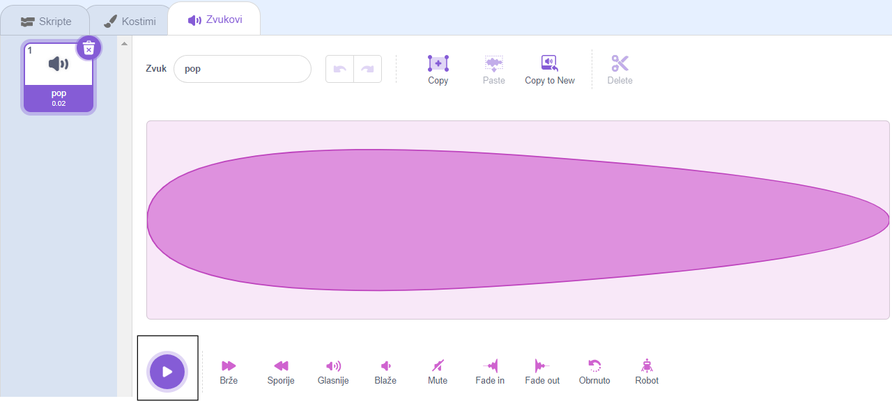
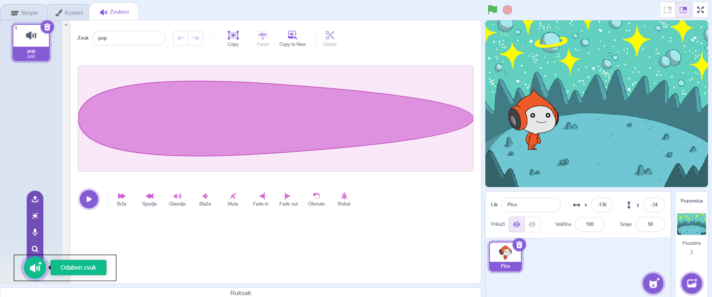
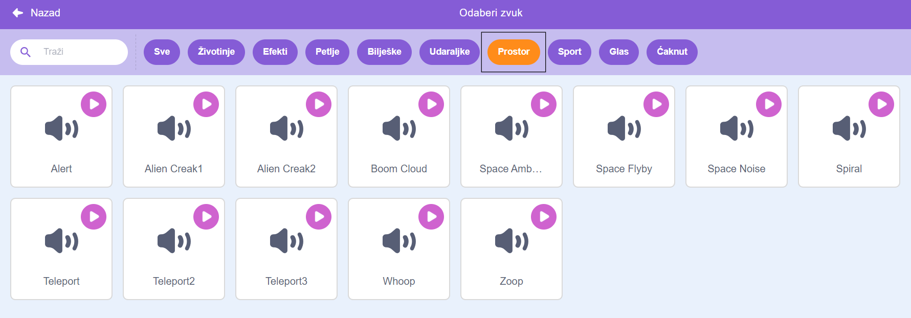
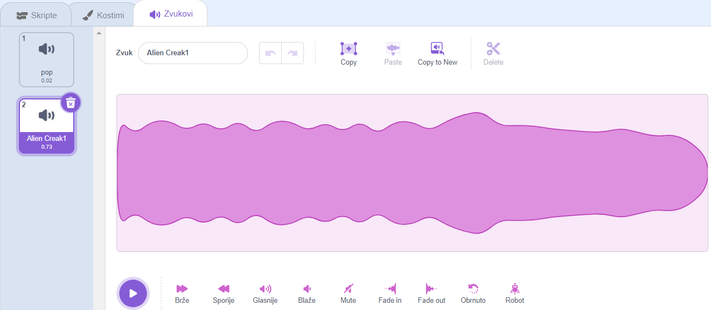
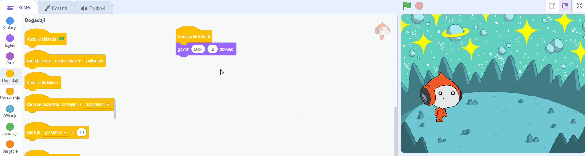
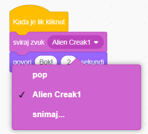

## Pico pušta zvuk

<div style="display: flex; flex-wrap: wrap">
<div style="flex-basis: 200px; flex-grow: 1; margin-right: 15px;">
Drugi način komunikacije je korištenje zvuka.
</div>
<div>

{:width="300px"}

</div>
</div>

### Dodajte zvuk Pico liku

--- task ---

Kliknite karticu **Zvukovi** za **Pico** lik i pronaći ćete **pop** zvuk. Kliknite na **Reproduciraj** ikonu da čujete **pop** zvuk.



**Debug**: Ako ne čujete zvuk, provjerite radi li zvuk na vašem računalu ili tabletu.

--- /task ---

--- task ---

Da biste odabrali novi zvuk, kliknite na ikonu **Odaberi zvuk** i odaberite kategoriju **Prostor** ili upišite `space` u okvir za pretraživanje.






--- /task ---

--- task ---

Reproducirajte nekoliko različitih zvukova koristeći **Reproduciraj** ikone. Nakon što pronađete zvuk koji želite koristiti, kliknite na njega da biste ga dodali u svoj projekt.



--- /task ---

### Neka se zvuk reproducira kada se klikne (ili dodirne)

--- task ---

Kliknite karticu **Skripte**. U izborniku blokova `Zvuk`{:class="block3sound"} pronađite `sviraj zvuk`{:class="block3sound"} blok.

Povucite blok u područje koda, između bloka `kada je lik kliknut`{:class="block3events"} bloka i `govori`{:class= "block3looks"} bloka. Otvoriće se praznina i blok će se automatski postaviti na mjesto.



Tvoj kod bi trebao izgledati ovako:


```blocks3
when this sprite clicked
+start sound [Alien Creak1 v] 
say [Hello!] for [2] seconds // hide speech after 2 seconds
```

--- /task ---

### Testiraj svoj kod

--- task ---

Provjerite sadrži li vaš `sviraj zvuk`{:class="block3sound"} blok zvuk koji ste odabrali. Ako se ne pojavi, trebate kliknuti na zvuk u bloku `sviraj zvuk`{:class="block3sound"}, zatim odabrati odabrani zvuk u padajućem izborniku.



--- /task ---

--- task ---

**Test:** Kliknite na **Pico** lik i provjerite pojavljuje li se oblačić s govorom i čujete li zvuk. Ako ne čujete zvuk, provjerite jeste li dodali blok `sviraj zvuk`{='block3sound'} ispod bloka `kad je lik kliknut`{='block3events'}.

--- /task ---

