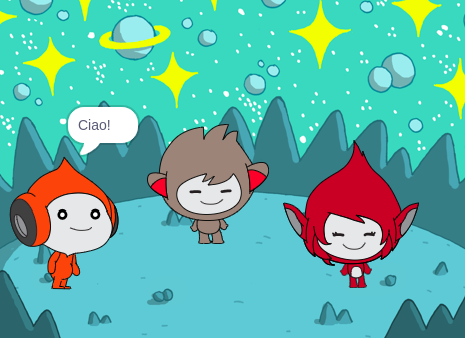

## Quello che farai

Crea una scena spaziale con personaggi 👾 che condividono i loro pensieri ed emozioni.

In Scratch, i personaggi e gli oggetti sono chiamati **sprite** e appaiono nello **Stage**.

Tu:
+ Aggiungi degli sprite e uno **sfondo** per iniziare il tuo progetto
+ Clicchi sugli sprite per farli comunicare usando i blocchi di codice `Aspetto`{:class="block3looks"} e `Suono`{:class="block3sound"}
+ Usa **l'editor dei costumi** per modificare un **costume**

--- no-print ---
--- task ---
### Gioca ▶️

  
Clicca su ogni sprite per vedere quello che fanno. 

Cosa succede se clicchi su uno sprite e poi clicchi velocemente su un altro sprite?

  <iframe allowtransparency="true" width="485" height="402" src="https://scratch.mit.edu/projects/embed/946016490/?autostart=false" frameborder="0"></iframe>

--- /task ---
--- /no-print ---

--- print-only ---

--- /print-only ---

