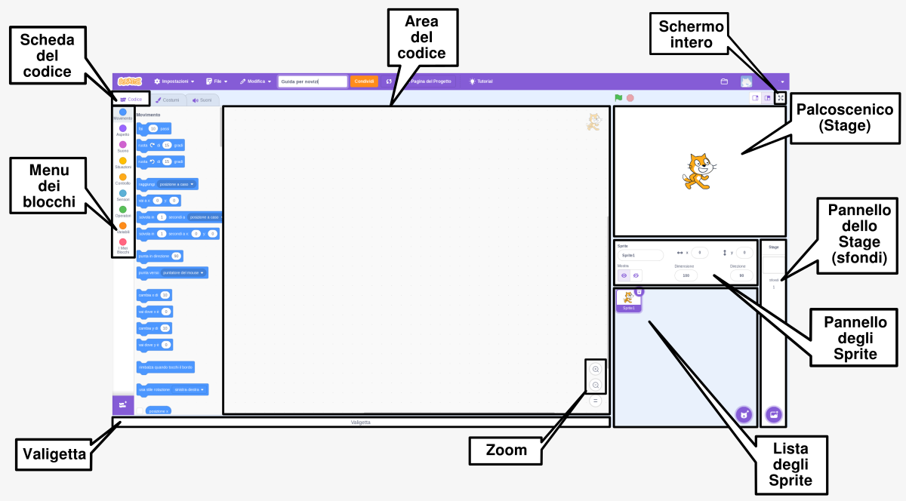

## Crea la tua scena

Inizia il tuo progetto con uno sfondo spaziale e il primo sprite. 

{:width="300px"}

### Apri il progetto iniziale

--- task ---

Apri [il progetto iniziale Conversazione spaziale](https://scratch.mit.edu/projects/582213331/editor){:target="_blank"}. Scratch si aprirà in una nuova scheda del browser.

[[[working-offline]]]

--- /task ---

### L'editor di Scratch

### Aggiungi uno sfondo

Lo **Stage** dove il tuo progetto viene eseguito. Uno **sfondo** cambia l'aspetto dello Stage.

--- task ---

Clicca (o su un tablet, tocca) su **Scegli uno Sfondo** nel pannello Stage:

--- /task ---

--- task ---

Clicca sulla categoria **Spazio** o scrivi `space` nella barra di ricerca:

--- /task ---

Nel nostro esempio, abbiamo scelto lo sfondo **Space**, ma scegli pure lo sfondo che ti piace di più.

--- task ---

Clicca sullo sfondo che hai scelto per aggiungerlo al tuo progetto. Lo Stage dovrebbe mostrare lo sfondo che hai scelto:

--- /task ---

### Aggiungi uno Sprite

Riesci a vedere lo sprite che è già presente nel tuo progetto? Quello è Scratch Cat (il gatto di Scratch).

--- task ---

Elimina lo sprite **Sprite1** (Scratch Cat): seleziona lo sprite **Sprite1** nella lista sotto allo Stage e clicca sull'icona **Elimina**.

--- /task ---

--- task ---

Clicca su **Scegli uno Sprite** nella lista degli Sprite:

--- /task ---

--- task ---

Seleziona la categoria **Fantasia**. Clicca sullo sprite **Pico** e aggiungilo al tuo progetto.

--- /task ---

--- task ---

Trascina lo sprite **Pico** per posizionarlo sul lato sinistro dello Stage. Il tuo Stage dovrebbe avere questo aspetto:

--- /task ---

--- task ---

**Salva**: se hai effettuato l'accesso con il tuo account Scratch, clicca sul bottone verde Remix. Questo salverà una copia del progetto sul tuo account Scratch.

Scrivi il nome del tuo progetto nella casella di testo nella parte superiore dello schermo.

**Suggerimento:** Dai nome utile ai tuoi progetti così li puoi trovare facilmente quando ne hai molti.

Adesso, clicca su **File**, e poi su **Salva ora** per salvare il tuo progetto.

Se non sei online o non hai un account Scratch, puoi cliccare su **Salva sul tuo computer** per salvare una copia del progetto.

--- /task ---

